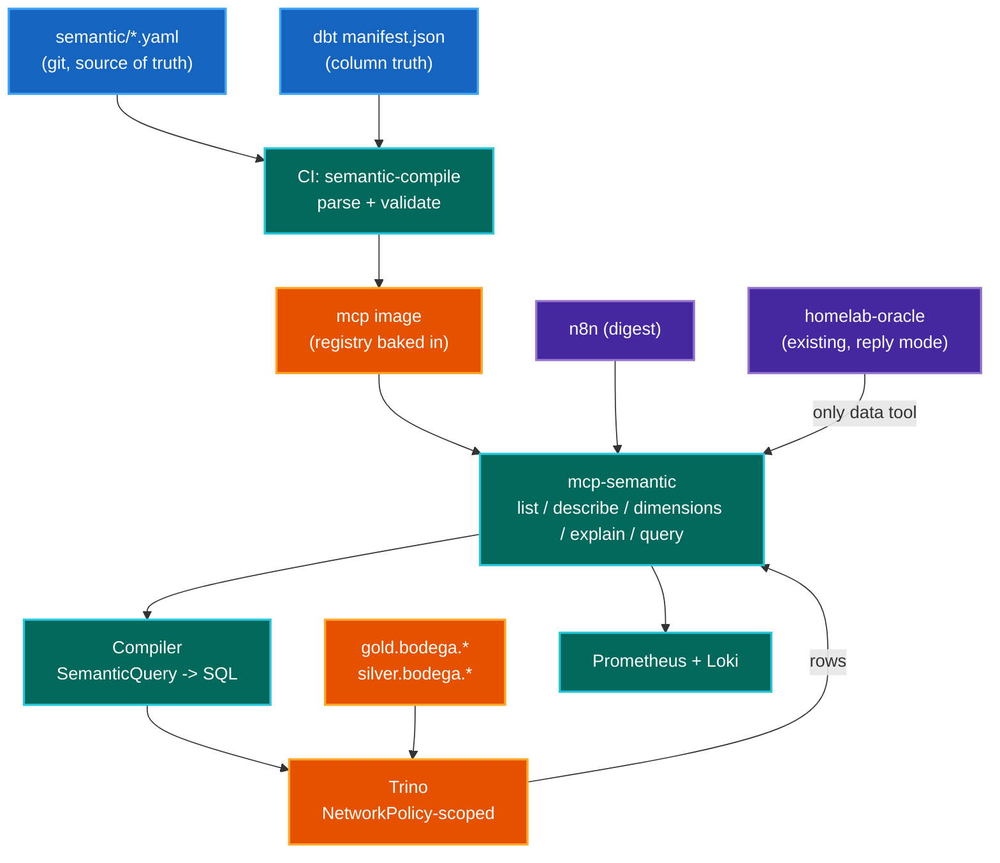

# Semantic Layer + `homelab-analyst` — Design Spec

## 1. Context

### 1.1 Where the platform is today

The lakehouse runs end to end. `bodega` is the first real analytical domain:
n8n drains parsed Mercadona invoices into Kafka, dlt lands them in
`bronze.bodega.raw_invoices`, dbt builds four silver models and six gold models
into Iceberg over Apache Polaris, and `bodega_daily` orchestrates the chain
(`dlt ingest → dbt silver → dlt enrich → dbt gold`). Trino queries all of it;
Superset visualises it.

Sympozium runs three ensembles — `homelab-ops`, `homelab-responder`,
`homelab-reviewer`. `agents/mcp/` ships `homelab_facts`, sixteen tools that
gather deterministically so a small model does not have to.

**Trino is already in the agent fleet, and it stays.** `homelab-oracle` holds
`trino_list_catalogs`, `list_schemas`, `list_tables`, `get_table_schema` and
`trino_execute_query` against six `postgresql_*` catalogs and the four Iceberg
ones. That path answers questions this project does not address — what tables a
database has, what columns they carry, how many rows are in one — and it is the
only route to the `postgresql_*` catalogs, which no semantic model will ever
cover.

So this is an **addition, not a migration**. The semantic layer gives the fleet
bodega *knowledge*: what a number means, what it leaves out, and which one to
use. It does not take the existing SQL reach away.

### 1.2 The problem

Raw SQL is the wrong contract for an agent asking *analytical* questions. It is
a fine contract for structural ones, which is why it stays (§1.1) - the two are
different jobs and the distinction runs through this whole document.

A structural question has one right answer that the database itself knows:
`SHOW STATS FOR postgresql_superset.public.dashboards` returns a row count, and
no judgement was needed to get it. An analytical question does not. Asked "how
much did I spend on dairy last month", a model composing SQL must reconstruct:

- which mart is authoritative for a concept — `total_amount` appears in
  `invoices`, `spending_by_day`, `spending_by_week`, `category_spending` and
  `top_products`, at four different grains
- the filters a metric implies — is a returned line excluded? is tax included?
- the join path between two marts — `invoice_items` to `products` is a two-column
  join with a `max_by` dedupe that four gold models each re-implement
- the correct time grain, and whether the current period is complete

Each is a silent-wrong-answer generator. Nothing in the response distinguishes a
correct number from a plausible one, so every answer needs manual verification —
which removes the reason for having the agent.

This is not hypothetical here. The oracle's Trino path has already produced, in
its first four threads: a count of 52 over 53 correct rows, a described query it
never ran, and a refusal to a follow-up in a thread it had already answered. The
current mitigation is that its prompt carries **exactly one permitted SQL
statement** (`SHOW STATS FOR ...`) written out in full, with a rule that no other
SQL may be composed. That rule works, and it is also an admission: the safe
number of statements a 4B-class model may compose is one, and it had to be
pre-written.

Business meaning currently lives in three disconnected places — dbt model SQL,
Superset chart definitions, and prompt text. They drift.

### 1.3 The approach

Move meaning out of prompts and into a governed, machine-readable registry, then
give the agent a tool interface over *that* instead of over SQL.

```
Today:     question -> LLM -> SQL -> Trino -> rows
Proposed:  question -> LLM -> semantic query -> compiler -> SQL -> Trino -> rows
```

The agent needs metric and dimension *names*. It never needs a formula, a filter
condition, or a join path. This is the same move `agents/mcp/` already made for
Prometheus: `used_percent()` cannot be the bare ratio because the code owns the
expression, and a wrong query is not expressible. `mcp-semantic` is that
principle applied to SQL.

### 1.4 Why the two pieces ship together

A semantic layer with no consumer is dbt with extra ceremony. An analyst agent
with no semantic layer is a text-to-SQL demo. The registry **is** the agent's
tool schema — the interface is the deliverable, so they are specified as one
project.

---

## 2. Goals

| #  | Goal | Acceptance signal |
|----|------|-------------------|
| G1 | Single definition per metric, consumed by Trino, Superset and agents | The weekly bodega digest (§8 Phase 0) produces identical numbers via `mcp-semantic` and via its original hand-written SQL |
| G2 | The agent cannot express an undeclared filter or metric | Schema validation rejects it; no free-text SQL path exists in the analyst toolset |
| G3 | Governance enforced by CI, not review discipline | A PR renaming a gold column a metric depends on fails `semantic-compile` |
| G4 | Answers are auditable | Every response traceable to compiled SQL + `registry_version` in Loki |
| G5 | Regressions are measurable | Deterministic eval suite runs in CI on any prompt/model/registry change |
| G6 | Refusal over improvisation | Unanswerable eval set passes >= 95% |

### 2.1 Non-goals

- Replacing Superset for human exploration. This targets conversational questions
  and scheduled digests.
- A general text-to-SQL capability. Deliberately excluded.
- Multi-tenant governance. Single operator; RBAC beyond one service identity is
  out of scope — and see §5.4 on why "identity" overstates what Trino gives us.
- Real time. Metrics resolve against Iceberg marts at existing dbt freshness.
- Agent-initiated writes to data. Read-only, permanently.
- Removing or narrowing any existing Trino tool. All five stay on
  `homelab-oracle`, `trino_execute_query` included. This project adds a second,
  narrower path beside them; it does not replace the first.
- Routing structural questions through the semantic layer. Table names, column
  types and row counts stay on Trino, where they are already correct.

---

## 3. Architecture



### 3.1 Layer responsibilities

| Layer | Component | Owns | Must not |
|-------|-----------|------|----------|
| L1 | Registry (YAML) | Metric/dimension/entity definitions, ownership, exclusions | Contain SQL fragments the compiler cannot validate |
| L2 | `mcp-semantic` | Discovery, compilation, execution, byte budgets, telemetry | Accept SQL or unvalidated predicates |
| L3 | `homelab-analyst` persona | Question -> semantic query -> answer | Hold credentials or reach Trino directly |
| L4 | Evals | Plan-level correctness, refusal behaviour | Judge prose quality with an LLM |

Trust boundary: **L3 is untrusted.** Every constraint that matters — row limits,
byte budgets, schema reachability, timeouts — is enforced at L2, not by prompt
instruction. This is the standing rule in `agents/sympozium/MEMORY.md`:
`toolPolicy` filters schema registration, not dispatch, so a prompt is never a
boundary.

---

## 4. Layer 1 — Registry

### 4.1 One artifact, in git

YAML under `workflows/dbt/semantic/`, next to the dbt projects whose columns it
references. It is **baked into the `mcp-semantic` image at build time** and
loaded at process start.

Rejected for v1: writing the registry into `iceberg.semantic.*` tables. The four
arguments for it — queryable from Trino, snapshot history, stateless replicas,
no new operator — are all real and none of them binds at 8 metrics. Git already
gives history and review; a file in an image gives stateless replicas for free
and dissolves the cache-invalidation question entirely. Revisit when either the
registry outgrows one file, or Superset needs to chart metric coverage
(§8 Phase 6). Recording it here so it is a deferral rather than an omission.

### 4.2 Schema

MetricFlow-compatible — `semantic_models` / `metrics` as dbt defines them. Do not
invent a spec; the compatibility is what keeps the migration path in §4.4 open.

Grounded in the columns that exist today in `workflows/dbt/projects/bodega/`:

```yaml
semantic_models:
  - name: invoice_items
    model: ref('invoice_items')          # silver.bodega.invoice_items
    defaults:
      agg_time_dimension: invoice_date
    entities:
      - {name: invoice,     type: foreign, expr: invoice_number}
      - {name: store,       type: foreign, expr: store_vat_id}
      - {name: product_key, type: foreign, expr: description_clean}
    dimensions:
      - name: invoice_date
        type: time
        type_params: {time_granularity: day}
      - {name: description_clean, type: categorical}
      - {name: supermarket,       type: categorical}
      - {name: unit,              type: categorical}
    measures:
      - {name: line_amount,   agg: sum, expr: total_amount}
      - {name: line_quantity, agg: sum, expr: quantity}

  - name: invoices
    model: ref('invoices')               # silver.bodega.invoices
    defaults:
      agg_time_dimension: invoice_date
    entities:
      - {name: invoice, type: primary, expr: invoice_number}
      - {name: store,   type: foreign, expr: store_vat_id}
    dimensions:
      - name: invoice_date
        type: time
        type_params: {time_granularity: day}
      - {name: supermarket,    type: categorical}
      - {name: store_name,     type: categorical}
      - {name: payment_method, type: categorical}
    measures:
      - {name: basket_amount, agg: sum,   expr: total_amount}
      - {name: basket_count,  agg: count, expr: invoice_number}
      - {name: tax_amount,    agg: sum,   expr: total_tax_amount}

  - name: category_spending
    model: ref('category_spending')      # gold.bodega.category_spending
    defaults:
      agg_time_dimension: invoice_date
    entities:
      - {name: store, type: foreign, expr: supermarket}
    dimensions:
      - name: invoice_date
        type: time
        type_params: {time_granularity: day}
      - {name: category,    type: categorical}
      - {name: subcategory, type: categorical}
      - {name: supermarket, type: categorical}
    measures:
      - {name: category_amount, agg: sum, expr: total_spent}

metrics:
  - name: grocery_spend_eur
    label: "Grocery spend (EUR)"
    type: simple
    type_params: {measure: basket_amount}
    meta:
      owner: alvaro
      grain_min: day
      description: >
        Total invoice value, VAT included, one row per shopping trip.
        The receipt total as printed.
      excludes: >
        Only supermarkets whose e-receipts reach the Gmail inbox and parse -
        currently Mercadona. Cash purchases with no e-receipt, any receipt the
        parser rejected, and every non-grocery purchase are absent entirely.
        Returns are included as whatever sign the receipt carried; they are not
        separated out.

  - name: category_spend_eur
    label: "Spend by category (EUR)"
    type: simple
    type_params: {measure: category_amount}
    meta:
      owner: alvaro
      grain_min: day
      description: >
        Line-item spend attributed to an LLM-assigned product category.
      excludes: >
        Does NOT sum to grocery_spend_eur. category_spending aggregates
        invoice_items, whose line totals exclude any invoice-level rounding, and
        uncategorised lines land in the literal category OTHER rather than being
        dropped. Categories come from silver.bodega.products, assigned once per
        (description_clean, supermarket) by an LLM, and a parse failure is stored
        as OTHER / PARSE_ERROR - indistinguishable from a genuine OTHER.

  - name: basket_count
    label: "Shopping trips"
    type: simple
    type_params: {measure: basket_count}
    meta:
      owner: alvaro
      grain_min: day
      description: "Number of invoices, i.e. distinct shopping trips."
      excludes: >
        One receipt is one trip. Two receipts on one visit count twice.

  - name: avg_basket_eur
    label: "Average basket (EUR)"
    type: ratio
    type_params:
      numerator: grocery_spend_eur
      denominator: basket_count
    meta:
      owner: alvaro
      grain_min: week
      description: "Mean invoice total across trips in the period."
      excludes: >
        Unweighted mean over trips, not over items. A single large stock-up
        moves it as much as a month of small trips. grain_min is week because
        a daily mean over one or two trips is noise.

  - name: blended_unit_price_eur
    label: "Blended unit price (EUR)"
    type: ratio
    type_params:
      numerator: line_amount
      denominator: line_quantity
    meta:
      owner: alvaro
      grain_min: week
      description: >
        Spend divided by quantity for the matching lines.
      excludes: >
        The unit is NOT constant. Receipts price weighted goods per kg and
        everything else per unit, so this is EUR/kg for weighted lines and
        EUR/unit otherwise. It is only meaningful filtered to one
        description_clean, or grouped by it - never as a single headline number.
        Lines with quantity 0 or null are dropped by the division.
```

**`excludes` is mandatory.** A metric that does not state what it leaves out
fails validation. This is the highest-leverage rule in the spec, for two
reasons. It forces the definitional thinking that otherwise never happens —
writing `category_spend_eur`'s exclusion is what surfaces that it cannot equal
`grocery_spend_eur`. And it gives the agent the material to answer "why doesn't
this match my bank statement?", which is the question that actually gets asked.

Note what §4.2 already found by being written against real columns:
`blended_unit_price_eur` has no fixed unit, because `price_trends.sql` blends
EUR/kg and EUR/unit deliberately. A metric with no fixed unit is exactly the
thing a model will report as a headline number. It is declared `grain_min: week`
and its `excludes` says so, which is the only defence available.

### 4.3 `semantic-compile` (CI step)

1. Parse and schema-validate the YAML against Pydantic models.
2. Resolve every `ref()` against the **dbt manifest** (`target/manifest.json`,
   produced by `dbt parse`), not against a live warehouse.
3. **Validate every `expr` against the manifest's column list** for that model —
   existence, and type compatibility with the declared `agg`.
4. Reject on: missing `excludes`; duplicate metric name; a `group_by` dimension
   not declared on the model; an undeclared join; `grain_min` finer than the
   model's `agg_time_dimension` granularity; unresolvable column.
5. Stamp `registry_version` = git sha into the built artifact.

Runs on every PR. **Offline** — no cluster, no Trino, no credentials, matching
how `workflows/dbt/tests/` already uses `dbt parse`. G3 is satisfied by step 3:
renaming a gold column without updating the registry fails the build.

Dimension cardinality and sample values (`approx_distinct`, distinct-value
`LIMIT 5`) genuinely need the warehouse and are therefore **not** a PR gate.
They are refreshed cluster-side into a sidecar file the server reads, and their
absence degrades `list_dimensions` to names-only rather than failing anything.

The temptation to move step 3 to a live `DESCRIBE` "because it is more real" is
the failure mode to resist: it makes CI cluster-dependent, and a Trino
permission change here is a coordinator restart (§5.4), so a red build would
routinely mean "someone rolled the coordinator" rather than "a column moved".

### 4.4 Compiler engine decision

| Option | Verdict |
|--------|---------|
| dbt MetricFlow + `dbt-trino` | Standard spec, but the Trino adapter is less exercised than Snowflake/BigQuery, and MetricFlow's runtime is a second service. Keep the YAML schema; defer the runtime. |
| Cube (self-hosted) | Mature, but duplicates the modelling layer and adds a service with its own semantic definitions to drift from dbt. |
| **Own compiler (chosen)** | Roughly 200 lines for simple and ratio metrics over declared joins. The agent contract is the valuable part; MetricFlow or Cube can slot in behind the same five MCP tools later without the persona noticing. |

Keeping the YAML MetricFlow-compatible is what preserves that option.

---

## 5. Layer 2 — `mcp-semantic`

A **second project in the existing `agents/mcp/` sub-project** —
`projects/semantic/`, exposing `register(registry)` exactly as
`homelab_facts` does, served by the same `mcp_runner` and the same image.
Not a new repository, not a new chart: `agents/sympozium/templates/mcpservers.yaml`
gains one `Deployment`/`Service`/`MCPServer` triple.

### 5.1 Tool contract

| Tool | Input | Output | Notes |
|------|-------|--------|-------|
| `list_metrics` | `search?` | `[{name, label, description, excludes, grain_min, dimensions[]}]` | Registry is small; return it all |
| `describe_metric` | `name` | Definition, `excludes`, compatible dimensions, one example question | |
| `list_dimensions` | `metric` | `[{name, type, cardinality, sample_values[]}]` | Samples are what stop invented filter values |
| `explain` | `SemanticQuery` | Compiled SQL and the resolved window. **No execution** | Self-check, and the human debug path |
| `query` | `SemanticQuery` | `{rows, row_count, is_partial_period, partial_bucket, excludes_applied, registry_version, ms}` | |

**No `run_sql`.** Not gated, not approval-wrapped — absent.

Every answer declares a byte budget and truncates by whole lines, saying that it
did, exactly as `homelab_facts` does. One ~16KB tool result reproducibly ends a
run with `terminal turn had empty text`; no answer here exceeds 4KB. `query`
enforces this *after* `limit`, so a 5000-row request is truncated by the server
rather than overflowing the model.

`query` returns `excludes_applied` — the `excludes` text of every metric in the
result. This is deliberate: the "critic" that the previous draft made a separate
persona is a **field in the tool result**, because a rule the model must apply is
weaker than a value it must print.

### 5.2 Request schema

```python
class Filter(BaseModel):
    dimension: str
    op: Literal["=", "!=", "in", "not_in", ">", ">=", "<", "<=", "contains"]
    value: str | float | list[str | float]

class TimeRange(BaseModel):
    grain: Literal["day", "week", "month", "quarter", "year"]
    last: str | None = None          # "12 months"
    start: date | None = None
    end: date | None = None

class SemanticQuery(BaseModel):
    metrics: conlist(str, min_length=1, max_length=5)
    group_by: list[str] = []
    filters: list[Filter] = []
    time_range: TimeRange
    order_by: str | None = None
    limit: int = Field(200, le=1000)
```

Validation before compilation:

- every metric exists
- every `group_by` and `filter.dimension` is declared on the metric's model
- `time_range.grain` is not finer than `max(grain_min)` across requested metrics
- `order_by`, if set, is one of the **projected output names** — `period`, a
  `group_by` name, or a metric name. It is never interpolated from free text
  (§5.3)
- categorical filter values are checked against sampled values, with a near-miss
  suggestion on failure: `"Mercadonna" -> did you mean "MERCADONA"?`

The near-miss matters more than it looks here, because `description_clean` and
`store_name` are `trim(upper(...))` in silver. A model will filter on
`"Leche Entera"` and match nothing. The suggestion converts a silent empty result
into a corrected retry.

G2 falls out of the type system: an undeclared filter is a validation error, not
a wrong number.

### 5.3 Compiler

```python
def compile(q: SemanticQuery, reg: Registry) -> tuple[str, list]:
    metrics = [reg.metric(m) for m in q.metrics]
    model   = resolve_model(metrics, q.group_by, reg)   # raises on undeclared join
    dims    = [reg.dimension(model, d) for d in q.group_by]

    select  = [f"{time_bucket(model.time_dim, q.time_range.grain)} AS period"]
    select += [f"{d.expr} AS {ident(d.name)}" for d in dims]
    select += [m.render() for m in metrics]             # sum(...) / ratio as CTE

    where, params = render_filters(q.filters, reg, model)   # bound params only
    start, end    = resolve_window(q.time_range)
    where += [f"{model.time_dim} >= ?", f"{model.time_dim} < ?"]
    params += [start, end]

    projected = ["period"] + [d.name for d in dims] + [m.name for m in metrics]
    order     = q.order_by if q.order_by in projected else "period"   # allowlist

    group = list(range(1, len(dims) + 2))
    sql = (f"SELECT {', '.join(select)} FROM {model.table} "
           f"WHERE {' AND '.join(where)} "
           f"GROUP BY {', '.join(map(str, group))} "
           f"ORDER BY {order} "
           f"LIMIT {int(q.limit)}")
    return sql, params
```

Rules:

- **Parameter binding for every agent-supplied value.** `d.expr` and
  `model.table` come from the registry, which is reviewed YAML in git, not from
  the request. `order_by` and `limit` come from the request and are therefore
  allowlisted and cast respectively — the previous draft interpolated `order_by`
  directly one line under a rule forbidding exactly that.
- **Single model unless a join is declared.** Cross-model without a declared path
  raises, naming the two models. The compiler never guesses a join.
- **Partial-period flag.** If the window's last bucket is incomplete relative to
  `now()`, return `is_partial_period: true` and name the bucket. The value is
  returned; the prompt requires printing it.
- **Ratio metrics compile as `sum(num) / nullif(sum(den), 0)`** at the group
  grain — never as an average of per-row ratios. `blended_unit_price_eur` is
  exactly this trap: `AVG(unit_price)` in `top_products.sql` and
  `SUM(total)/SUM(quantity)` in `price_trends.sql` are different numbers, and
  only the second is the metric.
- Multi-model with declared joins: fan-out-safe — aggregate each side to the
  join grain in CTEs before joining. Additive measures only in v1.

### 5.4 Guardrails (platform-enforced)

| Control | Implementation |
|---------|----------------|
| Reachable schemas | Trino file-based access control: `SELECT` on `silver.bodega` and `gold.bodega` only, for the user this server sends |
| Query cost | Session properties per query: `query_max_execution_time=30s`, `query_max_scan_physical_bytes`, `query_max_memory` |
| Concurrency | Dedicated Trino resource group so an agent loop cannot starve Superset |
| Answer size | Per-tool byte budget in `mcp-semantic`, truncating by whole lines |
| Network | NetworkPolicy: only the `mcp-semantic` pod reaches the coordinator. Agent pods have no route to Trino |
| Rate limit | Per-caller token bucket in `mcp-semantic` |
| Pod label | `app.kubernetes.io/name: mcpserver`, or core's `agent-allow-tools` NetworkPolicy blocks 8080 and every call times out with no useful error |

**Trino here requires no authentication.** `web-ui.authentication.type=FIXED`
covers the UI only; the HTTP API accepts any `X-Trino-User`, verified by running
`SHOW CATALOGS` as an invented user. So a Trino user name is a **label, not a
credential**: the access-control rules bind to a string the caller asserts.

Two consequences, and neither is optional:

1. The real boundary is the **NetworkPolicy plus the absence of a SQL tool**, not
   the user name. Do not write "svc-analyst provably cannot read raw" as though
   an identity enforced it — anything that can reach the coordinator can claim
   any user. This is also the property that keeps `agents/mcp/` credential-free,
   which is worth preserving.
2. **A permission change to this Trino is a coordinator restart.**
   `security.refresh-period=60s` does not reload `rules.json` — an edited file
   left the `mcp` user denied well past any refresh window until a
   `kubectl rollout restart`. A rules change is therefore a two-step operation,
   and a probe taken before the roll reads as a live denial rather than as stale.
   **Check the coordinator pod's age before believing a negative from this
   Trino.**

### 5.5 Observability

- **Loki**: one structured line per call — caller, `SemanticQuery` JSON, compiled
  SQL, params, `registry_version`, rows, duration, outcome. Tool *results* are
  logged nowhere by the runtime, so this is the only way to see what the model
  saw.
- **Prometheus**: `semantic_query_total{tool,status}`,
  `semantic_query_duration_seconds`,
  `semantic_validation_rejected_total{reason}`. ServiceMonitor alongside the
  existing ones.
- **Grafana**: rejections by reason is the most useful panel — it names exactly
  which metrics the registry is missing.

Langfuse is **not** in this stack today. If LLM-side tracing is wanted it is new
infrastructure with its own deployment, and it is out of scope for v1.

---

## 6. Layer 3 — the analyst persona

### 6.1 One persona, not four

The previous draft specified planner / executor / critic / reporter as four
roles. That is not expressible here and would not work:

- Sympozium personas are `workflowType: autonomous`, not `delegation` — the
  model is too small to be trusted with `delegate_to_persona`.
- A persona carries exactly one schedule and one prompt, so four roles means
  four `Agent` objects, four channel sidecars, and — because every sidecar
  delivers every instance's message — **four identical Slack copies** of every
  answer.
- Four personas is four prompts to keep correct. The oracle's took four
  iterations and a documented incident each; that cost is per-prompt, not
  per-ensemble.

The one reason that has **expired** is worth naming, because it was the strongest
one and it no longer holds: four runs used to queue against a single Ollama slot.
`homelab-responder` moved to OpenRouter (§6.4), so concurrency is now the
provider's problem. The fan-out and prompt-count reasons above are enough on
their own, but if a future split is wanted, this is no longer what blocks it.

So: **one persona.** The four jobs are relocated, each to something stronger than
a role.

| Former role | Where it goes now |
|-------------|-------------------|
| planner | The prompt's fixed tool order |
| executor | The prompt's retry rule — one retry on a validation error, using the returned suggestion |
| critic | Fields in the `query` result: `is_partial_period`, `partial_bucket`, `excludes_applied` |
| reporter | The run's final text, which *is* the message (§6.3) |

### 6.2 Where it lives, and what it sits beside

Nothing is removed. The five `semantic_*` tools are **added** to a persona that
keeps all five `trino_*` tools, so the design question is not what to swap but
how the model chooses between two paths that can both answer a question about
bodega — and what that costs in prompt budget.

#### The routing rule

One sentence decides it, and it belongs in the prompt as a positive instruction:

> A question about **what exists** - which tables, which columns, what type, how
> many rows - goes to `trino_*`. A question about **what a number means** - how
> much, how many, per what, compared to when - goes to `semantic_*`.

That line is doing real work, because the failure it prevents is silent. Asked
"how much did I spend on dairy last month", a model holding both paths can reach
`trino_execute_query`, compose a plausible `SUM(total_amount)` over
`gold.bodega.category_spending`, and return a number that is wrong in a way
nothing in the answer reveals - it would miss the `OTHER` bucket, or pick the
wrong one of the five models carrying `total_amount`, or silently mix the two
that cannot agree (§4.2). The semantic path cannot make any of those mistakes,
because the compiler owns the expression.

Two supports, because a routing rule in prose is not enough on its own:

- **`describe_metric` names its own source model.** When the model has already
  seen that `category_spend_eur` reads `gold.bodega.category_spending`, the pull
  toward re-deriving it in SQL is weaker.
- **The prompt states the consequence, not just the rule.** "A total you composed
  in SQL is a number no metric defines" - the same shape as the existing
  no-self-computed-count rule that fixed the 52-over-53 defect, which worked
  where a bare prohibition had not.

#### The tool budget is now the binding constraint

The oracle allows 33 tools today. Adding five without removing any makes 38, and
schema injection is paid on **every call in the loop**, not once - the measured
figures here are ~670 tokens per schema, 40,500 first-call input tokens without
`toolPolicy` against 4,095 with it.

38 tools is roughly 25k of schema. **On the window this persona used to have
that was most of the budget; on the one it has now it is not** - the responder
moved off the cluster Ollama to OpenRouter, so the 65,536/90K ceiling those
figures were sized against is no longer its ceiling (§6.4). Schema cost is now
money and latency rather than a cliff.

So it still gets measured - **Phase 5 records first-call input tokens before and
after** - but the expected outcome is that one persona holds both toolsets. The
fallback, if measurement contradicts that, is a second persona and never dropping
a Trino tool:

- `homelab-oracle` keeps the cluster tools and all five `trino_*`
- a new `homelab-analyst` persona in the same ensemble holds the five
  `semantic_*` tools and nothing else

That split costs a second Slack sidecar and therefore a second copy of any
message it delivers, tolerable for a reply-mode persona that only speaks when
asked. It stays the fallback because two personas is two prompts to keep correct
and the oracle's took four iterations to get right.

#### Wiring

Pin `toolPolicy.allow` and `mcpServers[].toolsAllow` to the same five
`semantic_*` names. Drift between the two is silent - it costs prompt budget and
fails nothing - so diff them by hand when either changes.

### 6.3 Prompt requirements

These are constraints, not a draft. Each one is a failure this fleet has already
paid for.

- **Plain text only.** `deliveryMode: reply` means nothing converts the output —
  the sidecar passes text through as written. No asterisks, no pipe tables, no
  backtick fences, no hash headings. Rows one per line. The oracle emitted
  `**156.7MiB total**` into Slack because a rule banned a pattern by displaying
  it; describe the failure, never exhibit it.
- **ASCII only inside indented blocks.** A `·` in a prompt caused the model to
  emit a broken byte pair, protobuf refused to marshal `status.result`, and the
  run reported `Succeeded` with no answer. Check with
  `grep -nP '^\s+.*[^\x00-\x7F]'`.
- **No self-computed quantities.** The oracle printed "52 total tables" over 53
  correct names — it counted its own output and got it wrong by one. The rows are
  the answer; a total nobody's tool returned is a number the model invented.
- **Print `excludes_applied` whenever the answer is a total**, and print the
  partial-period bucket whenever `is_partial_period` is true. Both are values in
  the result, so this is transcription, not judgement.
- **At most three lookups, with a named exit.** `explain` then `query` then one
  retry. When nothing resolves, the answer is what was checked plus
  `no metric matches` — stated as a legitimate finding, because a cap with no
  escape hatch relocates the silence rather than removing it.
- **Route by question type, not by habit** (§6.2). Structural questions go to
  `trino_*`; "how much" questions go to `semantic_*`. State the consequence -
  a total composed in SQL is a number no metric defines - because a bare
  prohibition invites the adjacent shape.
- **Refusal names the closest metric.** "I have no metric for electricity spend;
  the closest is grocery_spend_eur" is the target behaviour of §7.2, and it has
  to be in the prompt as a positive instruction rather than as a prohibition.
- **The answer is the final text.** No `send_channel_message` — it is not
  allowlisted for any persona here. A final turn that reports on the answer
  delivers that report *instead of* the answer.

### 6.4 Model and context budget

`homelab-responder` runs on **OpenRouter**, not on the cluster Ollama:

```
baseURL: https://openrouter.ai/api/v1
provider: openrouter
model:    deepseek/deepseek-v4-flash-0731
authRefs: openrouter-auth-credentials
```

`homelab-ops` and `homelab-reviewer` still point at
`http://datahub-local-core-data-ollama.data.svc:11434/v1` on `qwen3.5:4b`. **The
constraints are therefore no longer fleet-wide**, and this is the single most
consequential fact for this project's design.

Three limits that shaped every prompt in `agents/sympozium/` are Ollama-side and
do **not** apply to the analyst:

| Limit | Where it came from | Applies here? |
|-------|--------------------|---------------|
| 65,536 / 90K context | `OLLAMA_CONTEXT_LENGTH`, read from `GET /api/ps` with the model resident | **No** — that is a property of the local server |
| One resident model, one GPU slot | 6 GiB card; `OLLAMA_NUM_PARALLEL` rejected because llama.cpp divides `n_ctx` across slots | **No** — OpenRouter handles concurrency |
| 4B-class reasoning | `qwen3.5:4b` | **No** — this is a frontier-class hosted model |

What that buys, concretely:

- **The 38-tool budget stops being the binding constraint.** §6.2's measure-then-
  maybe-split contingency was written against a 90K ceiling. On a hosted model
  with a far larger window, ~25k of tool schema is a cost rather than a cliff.
  Measure it in Phase 5 anyway — it is paid on every call in the loop, so it is
  still real money and still latency — but plan for one persona holding both
  toolsets, and treat the split as unlikely rather than as a live contingency.
- **`limit` can be raised.** §5.2 caps it at 1000 rows and §5.1 budgets each
  answer to 4KB. Both were sized so one wide result could not end a run with
  `terminal turn had empty text`. Keep the *byte budget* — it is cheap insurance
  and it makes truncation explicit — but the row cap is now a readability
  question, not a survival one.
- **More metrics fit.** §4.1's "revisit past 8 metrics" concern was really a
  prompt-budget concern. `list_metrics` returning the whole registry stays viable
  well past the point it would have on Ollama.

What it does **not** buy, and this is where the temptation lies:

- **Every prompt rule in §6.3 stays.** They are not compensations for a small
  model. Plain-text output is a property of `deliveryMode: reply`, where nothing
  converts Markdown. ASCII-in-indented-blocks is a protobuf marshalling failure
  in the runner. "No self-computed quantities" is a discipline any model should
  keep when a tool result already carries the number. `MAX_TOOL_ITERATIONS: 100`
  is a real ceiling whose breach ends the run as `status: error`, delivering
  nothing at all.
- **The `excludes` mechanism is not a crutch either.** A larger model does not
  know that `grocery_spend_eur` and `category_spend_eur` cannot agree — nothing
  in the schema says so. That is registry knowledge, and it is the reason this
  project exists at all.
- **The routing rule matters more, not less.** A more capable model is *better*
  at composing plausible SQL, which makes a confidently wrong analytical answer
  more likely to look right, not less.

Do not backport any of this to `homelab-ops`. Those five reporters are still on
`qwen3.5:4b` behind one GPU slot, and every constraint above still binds there.

### 6.5 Entry points

1. **Slack mention or DM** on the existing oracle binding. Primary interface.
2. **Scheduled digest** via n8n (§8 Phase 0 builds it, Phase 4 migrates it).
3. **Claude Code** over the MCP gateway — direct `mcp-semantic` access for
   registry authoring, no persona involved. This is the fastest feedback loop for
   finding bad metric names and should be used heavily in Phase 2.

### 6.6 Superset write-back

**Deferred out of v1.** The previous draft had the agent open a PR into a
`datahub-local-workflows` repository; that repository does not exist, and
`workflows/superset/` already has the GitOps path it was proposing to invent —
YAML under `projects/<name>/dashboard_export/`, rebuilt into zips by
`scripts/build_bundles.py`, shipped as ConfigMaps.

If it returns, the shape is: agent proposes a dashboard YAML file as a PR into
this monorepo, and `build_bundles.py` runs in CI. Note the hard constraint that
makes this delicate — object `uuid`s are the stable identity across re-imports
and must never be regenerated. An agent generating a fresh `uuid` silently
creates a duplicate chart rather than updating one. That alone is reason enough
to leave it until the read path is proven.

---

## 7. Layer 4 — Evaluation

### 7.1 Plan-level scoring

Evaluate the `SemanticQuery`, not the prose. Deterministic, cheap, no LLM judge.

```yaml
# evals/semantic/bodega.yaml
- id: bod-001
  question: "How much did I spend on dairy last month?"
  expect:
    metrics: [category_spend_eur]
    group_by: []
    filters: [{dimension: category, op: "=", value: DAIRY_EGGS}]
    time_range: {grain: month, last: "1 month"}

- id: bod-002
  question: "What's my weekly grocery spend this year?"
  expect:
    metrics: [grocery_spend_eur]
    group_by: []
    time_range: {grain: week, last: "12 months"}
  must_flag: [partial_period]

- id: bod-003
  question: "Has milk got more expensive?"
  expect:
    metrics: [blended_unit_price_eur]
    group_by: [description_clean]
    filters: [{dimension: description_clean, op: contains, value: LECHE}]
    time_range: {grain: week, last: "6 months"}
  must_state: [excludes]        # the EUR/kg vs EUR/unit caveat

- id: bod-004
  question: "What's my average basket at Mercadona?"
  expect:
    metrics: [avg_basket_eur]
    filters: [{dimension: supermarket, op: "=", value: MERCADONA}]
    time_range: {grain: month, last: "3 months"}
```

Scoring: exact match on the metric set; F1 on `group_by` and `filters`; grain
match; `must_flag` and `must_state` assertions against the returned answer.

`bod-003` is the one that matters most. It is the metric with no fixed unit, and
a pass requires the model to have printed the caveat rather than a headline
number.

### 7.2 Unanswerable set

Non-negotiable. Roughly 10 questions with no matching metric:

- "What's my electricity spend per kWh?" — no energy model exists
- "How much did I spend at Lidl?" — only Mercadona receipts are parsed
- "What did I spend in cash last month?" — absent from the source entirely
- "Which products did I return?" — returns are not separated (see
  `grocery_spend_eur.excludes`)

Required behaviour: explicit refusal naming the closest available metric.
**Target >= 95%** (G6). This set is what separates a trustworthy analyst from a
confident one, and three of the four above are unanswerable *because an
`excludes` field says so* — which is the registry paying for itself.

### 7.3 CI trigger

Runs on any change to the prompt, model, registry YAML, or compiler. Fails the
build on regression against the last green run. Scoring is deterministic, so the
only cost is inference on ~50 questions.

Results land in a committed JSON under `evals/`, not in
`iceberg.semantic.eval_runs` — same reasoning as §4.1. Move them to Iceberg when
there is a trend worth charting.

---

## 8. Implementation plan

Each phase ends in something usable. Stop after any phase and the platform is
still better than before.

### Phase 0 — Write the metrics, ship nothing
- [ ] 6-8 metrics in YAML against the bodega models that exist today, each with a
      written `excludes`
- [ ] Hand-run each definition's SQL against Trino and record the number
- [ ] Build the weekly bodega digest in n8n from those hand-written queries
- **Done when:** you know whether `total_amount` summed from `invoices` and from
  `category_spending` agree, and by how much

This phase is new and it is the most valuable one. It costs a day, it produces
the digest that G1 needs as a baseline, and it front-loads the finding that
matters: if the definitions turn out contested, that is the result, and it
arrives before any code is written. §4.2 already produced two such findings just
by being written against real columns.

### Phase 1 — Registry and CI gate
- [ ] Pydantic models for the MetricFlow-compatible schema
- [ ] `semantic-compile`: parse -> validate `expr` against `manifest.json` ->
      stamp `registry_version`
- [ ] Wire into CI, offline, on every PR
- **Done when:** renaming a gold column in dbt fails the build

### Phase 2 — MCP server, discovery and `explain`
- [ ] `agents/mcp/projects/semantic/` with `register(registry)`
- [ ] `list_metrics`, `describe_metric`, `list_dimensions`
- [ ] `SemanticQuery` schema and validator, with near-miss suggestions
- [ ] `explain` — compile and return SQL, no execution
- [ ] Byte budgets per tool, tests against a fake Trino
- [ ] Deployment/Service/MCPServer in `agents/sympozium/templates/mcpservers.yaml`,
      multi-arch image, `app.kubernetes.io/name: mcpserver`
- [ ] Drive it manually from Claude Code
- **Done when:** you can ask a question, get a `SemanticQuery` plus SQL, and
  eyeball it. **This is where bad metric names get found — do not skip the manual
  period.**

### Phase 3 — Execution and guardrails
- [ ] Trino access-control rules for `silver.bodega` / `gold.bodega`, plus the
      coordinator restart that makes them take effect
- [ ] Resource group, session property caps, NetworkPolicy
- [ ] Compiler: single-model, simple and ratio metrics, bound params, allowlisted
      `order_by`
- [ ] Partial-period detection
- [ ] `query`, returning `excludes_applied`
- [ ] Loki structured logging, Prometheus metrics, ServiceMonitor
- [ ] Read `kubectl logs <run-pod> -c mcp-discover` after the deploy — a whole
      server failing to register is otherwise silent
- **Done when:** a query for an unreachable schema is refused, verified *after*
  confirming the coordinator pod age

### Phase 4 — Digest migration (the real test)
- [ ] Rewrite the Phase 0 digest to go through `mcp-semantic`
- [ ] Run both in parallel for 4 weeks
- **Done when:** the numbers are identical (G1). **Any discrepancy is a registry
  bug and is worth more than the rest of the phase.**

### Phase 5 — Wire the persona
- [ ] Measure `homelab-oracle`'s first-call input tokens **before** the change
- [ ] Add the five `semantic_*` tools. Remove nothing — all five `trino_*` stay
- [ ] Prompt section per §6.3, including the routing rule, ASCII-checked and
      plain-text-checked
- [ ] Measure first-call input tokens **after**; if headroom is gone, split
      `homelab-analyst` out per §6.2
- [ ] Run for two weeks, logging every question — including refusals, and
      including any bodega question that took the `trino_*` path
- **Done when:** the refusal log tells you which metrics to add next, and no
  bodega "how much" question in the log was answered by composed SQL

### Phase 6 — Evals
- [ ] ~40 answerable and ~10 unanswerable questions
- [ ] Scorer, committed results, CI gate on prompt/model/registry changes
- **Done when:** the unanswerable set is >= 95% and CI blocks a regression

### Phase 7 — Extend (optional)
- [ ] Second domain, forcing the declared-join work
- [ ] Fan-out-safe CTEs for multi-model queries
- [ ] Registry into `iceberg.semantic.*` if coverage charting is wanted
- [ ] Superset write-back (§6.6), `uuid` stability handled

---

## 9. Risks

| Risk | Mitigation |
|------|------------|
| **Metric sprawl** — 60 overlapping metrics is worse than 8 | Mandatory `excludes`. Track unused metrics from Loki and delete them. |
| **Metrics that cannot agree** — `grocery_spend_eur` vs `category_spend_eur` sum differently by construction | Phase 0 measures the gap before anything is built; both `excludes` fields state it; the eval set asserts the caveat is printed. |
| **A metric with no fixed unit** — `blended_unit_price_eur` is EUR/kg or EUR/unit per row | `grain_min: week`, an `excludes` that says so, and an eval (`bod-003`) that fails if the caveat is dropped. |
| **Cross-model joins** | Compiler refuses undeclared joins with an explicit error naming both models. Additive measures only in v1. |
| **Partial periods** | Compiler returns the flag and the bucket; the prompt prints values rather than applying rules; `must_flag` asserts it. |
| **Registry drift** | `semantic-compile` validates against the dbt manifest. The temptation to skip it "to move faster" is the actual risk. |
| **Confident wrong answers** | No free-text SQL in the analyst toolset; unanswerable eval set; every answer carries its `excludes` and `registry_version`. |
| **Trino permission changes appear not to apply** | They need a coordinator restart, not a refresh period. Check pod age before believing a denial. |
| **Prompt budget** | 38 tools, and nothing was removed to make room. Less binding than it looks — the responder is on OpenRouter, not the 65,536-token Ollama (§6.4) — but still paid on every call in the loop. Measure before and after Phase 5. |
| **Ollama-era constraints copied into this project by habit** | §6.4 lists which limits were properties of the local server and which are properties of the runner or the delivery mode. The second set still applies; the first does not. Do not backport the relaxations to `homelab-ops`, still on `qwen3.5:4b`. |
| **The model takes the SQL path for an analytical question** — both paths reach bodega, and composed SQL is wrong silently | The §6.2 routing rule stated as a consequence rather than a prohibition; `describe_metric` naming its source model; Phase 5's log reviewed for exactly this. |
| **Own compiler becomes a project** | Scope frozen at simple + ratio + declared joins. Past that, migrate to MetricFlow behind the same five tools — the YAML is already compatible. |

---

## 10. Open questions

Four of the previous five are closed; recording the reasoning so they are not
reopened by accident.

1. ~~Registry cache TTL~~ — **closed.** The registry is a file in the image
   (§4.1), so there is no cache and no invalidation.
2. ~~Does the responder get `mcp-semantic`~~ — **closed.** Yes, added beside the
   existing Trino tools rather than in exchange for any of them (§6.2). The two
   paths answer different questions and the prompt routes between them. What
   stays genuinely open is whether one persona should hold both toolsets - though
   the move to OpenRouter (§6.4) makes one the likely answer, and Phase 5 settles
   it with a measurement rather than an argument.
3. ~~Metric-level access control~~ — **closed.** No. Single operator, and
   restriction belongs per-persona in `projects/` where it is reviewable.
4. **Do Superset charts migrate to semantic-layer SQL, or keep their own queries
   and accept the drift?** Still open. Leaning: keep them, and treat any
   disagreement found in Phase 4 as a bug in one of the two. Superset's queries
   are reviewed YAML in git already, which is most of the governance argument.
5. ~~Registry version pinning for digests~~ — **closed.** Yes. Cheap, and it is
   the difference between a trend line and a coincidence. The digest pins a
   `registry_version` and a definition change requires an explicit bump.

---

## 11. Definition of done

- The weekly bodega digest runs through the semantic layer and produces the same
  numbers as its Phase 0 hand-written SQL
- Slack questions are answered with the metric's `excludes` and the
  `registry_version` attached
- `mcp-semantic` reaches only `silver.bodega` and `gold.bodega`, verified after
  a coordinator restart, with the NetworkPolicy — not the Trino user name —
  understood as the boundary
- `homelab-oracle` still holds all five `trino_*` tools, and structural questions
  are still answered by them
- No bodega "how much" question in Phase 5's log was answered by composed SQL
- CI fails on registry drift and on eval regression, with no cluster required
- The unanswerable set is >= 95%
- `agents/sympozium/MEMORY.md` gains the entry for whatever this breaks in
  production, because it will break something
