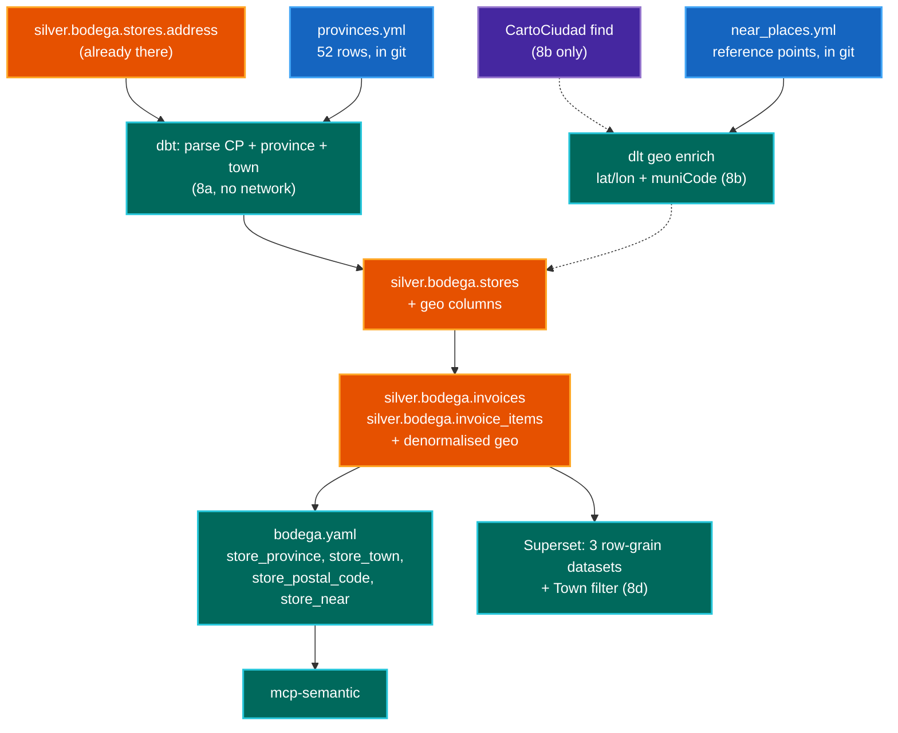

# Location Semantics — Design Spec

> **Third spec.** The first is [`002-01-semantic-layer.md`](002-01-semantic-layer.md)
> (**spec 001**), which
> built the registry, the compiler and the five `semantic_*` tools. The second is
> [`003-data-quality-and-lineage.md`](003-data-quality-and-lineage.md) (**spec 002**). This one adds one
> phase to spec 001: **where a shop is**, so "spend by province" and "near
> Rivas" become answerable instead of refused.
>
> It slots in as **spec 001 Phase 8**. Phase 7 ("Extend, optional") already names
> *"Second domain, forcing the declared-join work"* — geography is that domain,
> and §5 cashes in exactly as much of the join work as it needs.

---

## 0. Gate findings — read first

Five checks were run before this spec was allowed a plan. Three changed it, and
one removed a whole phase. Evidence first, because the plan below only makes
sense once these are known.

### Gate 1 — the postal code is already in the data. **No dataset needed for the first phase.**

`store_address` arrives as one free-text field from the receipt parser
(`workflows/dlt/projects/bodega/ingest.py:69`) and is carried into
`silver.bodega.stores` as `address`. Its format is fixed by the parser and
confirmed from two independent places — the ingest test fixture
(`workflows/dlt/tests/bodega/test_ingest.py:20`, `"C/ TEST 1, 28001 MADRID"`)
and a live Superset row, whose address has the same shape:

```
<street>, <number>, <5-digit CP> <TOWN>
```

A 5-digit postal code is therefore extractable by regex, and **its first two
digits are the INE province code** — the same `CPRO` the national code list
uses. Prototyped against four address shapes including the two real ones and a
`S/N` variant with no comma:

```python
re.compile(r'\b(0[1-9]|[1-4]\d|5[0-2])(\d{3})\b\s*(.*)$')
# 28001 MADRID           -> CP 28001, prov 28, town MADRID
# 03700 DENIA            -> CP 03700, prov 03, town DENIA
# 28522 RIVAS-VACIAMADRID-> CP 28522, prov 28, town RIVAS-VACIAMADRID
# 03700 DENIA (no comma) -> CP 03700, prov 03, town DENIA
```

The province-code bound `01..52` is what stops a house number or a phone
fragment matching. So **postal code, province code and town all derive from a
column that already exists** — no download, no API, no network, no licence.
That is Phase 8a, and it is most of the value.

The only reference data 8a needs is a **52-row province code -> name** mapping.
It is not a dataset in any meaningful sense: 52 rows, unchanged in their
current form since the 19th century, no personal data, and small enough to be
reviewable YAML.

### Gate 2 — GeoNames is not the postal authority it appears to be. **Rejected, measured.**

Correos genuinely sells the postal database and stopped publishing it free in
2017, so GeoNames `ES.zip` (CC BY 4.0, 543 KB, daily) looks like the obvious
open substitute. It was downloaded and counted rather than assumed:

| Check | Finding |
|-------|---------|
| Rows / distinct CPs | 37,867 / 11,150 — looks complete |
| Municipality coverage | **6,057 distinct INE codes against INE's 8,132 — 2,075 (25.5%) missing entirely** |
| Blank municipality codes | 821 rows |
| **The Rivas case specifically** | CP `28529` is labelled `Rivas-Vaciamadrid` with **no muniCode** |
| Coordinate grain | per *locality*, not per CP — CP `03700` carries **six** lat/lon pairs |
| Worst observed | an accuracy-1 row places a "Dénia" locality ~55 km away, in another province |

A naive CP -> municipality join therefore drops a quarter of Spain's
municipalities and, specifically, drops Rivas — the exact question this spec
exists to answer. **GeoNames is not used.** Recorded so it is not
re-proposed: it fails on the motivating example.

### Gate 3 — CartoCiudad answers the whole enrichment in one call. **Tested live.**

`https://www.cartociudad.es/geocoder/api/geocoder/find`, IGN, licence
CC-BY-4.0-compatible per [Orden FOM/2807/2015](https://www.boe.es/buscar/doc.php?id=BOE-A-2015-14129).
The literal example address was geocoded:

```
q = <street>, <number>, 03700 DENIA        # a real shop address
-> muniCode 03063, provinceCode 03, comunidadAutonomaCode 10,
   postalCode 03700, lat 38.8443, lng 0.1059
```

`muniCode` **is** INE `CPRO`+`CMUN`, so it joins to the national code list with
no crosswalk. Two traps found by testing rather than reading:

- **It silently returns the nearest neighbour.** No portal 23 exists at that
  street; it matched no. 13, then 24. `portalNumber` must be checked against the
  input rather than trusting the first candidate.
- **`candidates` returns `lat/lng = 0.0` for a `Municipio`.** Reading a centroid
  off it would place every municipality in the Gulf of Guinea. Centroids come
  from NGMEP, or from the boundary polygon `find?type=Municipio` returns.

Nominatim was rejected for this job: its usage policy caps recurring bulk
geocoding at 4 requests/minute and forbids systematic queries, and ODbL's
share-alike would attach to the enriched table if it were ever published.
CartoCiudad is Spain-specific, more accurate on Spanish addresses, and CC-BY.

### Gate 4 — a spatial predicate is inexpressible in the registry. **Structural, not a preference.**

Read off `datahub-local-ai-mcp`:

- Every `expr` must satisfy `.isidentifier()` — checked twice, at
  `servers/semantic/registry.py:449` and again at `src/mcp_runner/trino.py:43`.
  So `expr: ST_Distance(...)` and even `expr: concat(town, ', ', province)` are
  rejected by the CI gate. **Every dimension must be a bare column that dbt
  builds.**
- The filter operator set is `("=", "!=", "in", "not_in", ">", ">=", "<", "<=",
  "contains")` (`query.py:25`), and `contains` compiles to `LIKE '%value%'`
  only (`compiler.py:147`). There is no radius, no bounding box, no
  `ST_Within`.
- **There is no join concept at all.** The compiler emits exactly one `FROM`
  (`compiler.py:91`), and two separate guards refuse a cross-model metric by
  name (`registry.py:388`, `query.py:155`). `Entity{name,type,expr}` exists but
  **the compiler never consumes it** — it is only validated as a bare column.

Consequence: geography must be **denormalised onto the model tables**, and
"near" cannot be a distance computed at query time in v1. §5 turns "near" into
a pre-computed bare column instead, which is the only shape the registry can
express.

### Gate 5 — `category_spend_eur` cannot be made location-filterable. **Report it, don't fix it.**

`dimensions_for(metric)` returns the *owning model's* dimensions
(`registry.py:118`), so a metric is only location-filterable if the geo columns
sit on its own table. `invoices` and `invoice_items` both carry `store_vat_id`
and can be enriched. **`gold.bodega.category_spending` carries only
`supermarket` — a brand, not a location** — and no `store_vat_id`.

This is not an oversight to correct. The registry already documents the reason
in a comment on that model: its entity is deliberately named `brand` and not
`store`, because "one entity name over two different keys is a wrong join
waiting for the first declared join path". Adding location there means changing
that gold model's grain, which changes what every existing
`category_spend_eur` number means.

So Phase 8 makes **five of the eight metrics** location-aware and leaves
`category_spend_eur` alone. §7 states how the agent must answer
"spend on dairy near Rivas" — the one question this split makes
unanswerable — because a partial capability that fails silently is worse than
none.

---

## 1. Context

### 1.1 The problem, and the incident that already happened

This is not a speculative feature. The failure is in production and is already
written into the agent's memory seeds
(`agents/sympozium/projects/homelab-responder/agents/homelab-oracle.yaml`):

> Asked to filter shops by location, a dimension nothing here carries, this
> agent invented a street address no tool had returned and then treated every
> row as matching.

The current mitigation is a refusal. `06_evidence.md:13` of the oracle prompt
tells it that a question naming a property the data does not carry — *"in a
given city"* is the example given — must be answered in one line and stopped,
because "any total you produce is the unfiltered one wearing the question's
words".

That refusal is correct today and it is the thing this spec removes the need
for. The data to answer it has been sitting in `store_address` the whole time.

### 1.2 What exists today

`silver.bodega.stores` is built by `models/silver/stores.sql`, one row per
`store_vat_id`, carrying `name`, `address`, `phone`, `supermarket`,
`first_seen_date`, `last_seen_date`. It is:

- **absent from the semantic registry** — no `semantic_models` entry
- **read by no gold model** — `grep -l stores models/gold/*.sql` is empty
- **documented for exactly one column**, `store_id` (`models/schema.yml:99`)

The last point is load-bearing rather than cosmetic. The MCP server builds its
manifest from **Iceberg column comments** and keeps only non-blank ones
(`warehouse.py:98-102`), so `address` is currently invisible to the registry
gate. Documenting a column is part of shipping it, not paperwork after.

So `stores` is a dead-end dimension: built every run, consumed by nothing. That
makes it the natural carrier for geography, and it means Phase 8a adds a
consumer to an existing table rather than a table.

### 1.3 Scope

In: province, municipality and postal code as dimensions on the metrics whose
models can carry them; a bounded "near" that works for the motivating question;
the prompt and seed changes that stop the agent inventing geography; the same
three dimensions on the Superset datasets that can carry them (§8), including
retiring the raw `store_address` as a filter.

Out: anything requiring a boundary polygon (`ST_Contains` is Geometry-only on
Trino and needs a planar projection); `category_spend_eur` by location (Gate 5);
drive time; any second country.

---

## 2. Goals

| #  | Goal | Acceptance signal |
|----|------|-------------------|
| L1 | "Spend by province" is answerable | `semantic_query(metrics=[grocery_spend_eur], group_by=[store_province])` returns one row per province |
| L2 | "Near Rivas" is answerable, with a stated radius | The answer names the radius and the reference municipality it resolved to |
| L3 | The agent never invents geography again | The §7 eval set: every location question either answers from a dimension or refuses by name. No invented address, no unfiltered total wearing a filtered question's words |
| L4 | An ungeocoded shop is visible, never silently dropped | Totals with and without a location `group_by` agree to the cent; unresolved rows land in a literal `UNKNOWN` |
| L5 | The CI gate still passes offline | `semantic-compile` needs no warehouse, no network, no API key |
| L6 | No store address, coordinate or shop list enters git | Grep the diff; the enrichment writes to Iceberg, never to the repo. Note the Superset bundle is reviewed source, so a `defaultDataMask` is a real way to commit one (§8.4) |
| L7 | The dashboard offers a location filter that groups | `store_town` is groupable on the three row-grain datasets and the raw `store_address` is no longer filterable (§8.2) |

### 2.1 Non-goals

- Distance computed at query time. Inexpressible (Gate 4), and pre-computing is
  both cheaper and the only registry-legal shape.
- Boundary containment. `ST_Contains` needs Geometry, not `SphericalGeography`.
- `category_spend_eur` by location (Gate 5).
- Location on the gold aggregates, and so on 16 of the 25 Superset charts: that
  is a dbt grain change, not a dashboard one (§8.1).
- Migrating any Superset chart onto the semantic layer. Still spec 001's open
  question; §8 only adds columns to datasets that already compute their own SQL.
- Geocoding at query time. It happens once per new shop, in the pipeline.
- A general place-name resolver. §5.3 pins the reference points to a reviewed
  list rather than resolving free text, for the disambiguation reason in Gate 3.

---

## 3. Architecture



Two properties of that shape are the point:

**Everything the registry sees is a bare column on a dbt model.** The parsing,
the geocoding and the distance all happen upstream in dbt or dlt, because the
registry cannot express any of them (Gate 4).

**8a has no external edge at all.** The dotted CartoCiudad path is Phase 8b and
is the only part that touches the network. Stopping after 8a leaves province,
town and postal code working.

---

## 4. Phase 8a — parse what is already there

### 4.1 The reference file

`workflows/dbt/semantic/geo/provinces.yml` — 52 rows, `code` -> `name`:

```yaml
provinces:
  - {code: "01", name: Araba}
  - {code: "03", name: Alicante}
  - {code: "28", name: Madrid}
  # ... 52 total
```

In git because it is not data about this household — it is the national code
list, it is tiny, and it is reviewable. This is the same judgement the repo
already applies to `categories.csv` in the dlt project, and the opposite of the
one that deleted `dimension_samples.json`: that file was 428 *product names*
from the receipts, which is the household's data and was rightly removed.

> **As built, this is a macro rather than a file** — `bodega_provinces()` in
> `macros/cross_engine.sql`. dbt's Jinja has no filesystem read, so a model
> cannot join a YAML; see the "Deviations" note under Phase 8a in §9. The
> reasoning above is unchanged and is why it stayed in git and reviewable
> instead of becoming a seed.

### 4.2 The dbt work

A `bodega_parse_postal_code` macro in `macros/cross_engine.sql`, dispatched for
both engines like every other helper there — bodega must build on Trino
(homelab) and DuckDB (local), which is why `regexp_extract` cannot simply be
written inline.

`models/silver/stores.sql` gains:

| Column | How | Note |
|--------|-----|------|
| `postal_code` | regexp on `address`, Gate 1's pattern | `NULL` when no match |
| `province_code` | first two digits | the INE `CPRO` |
| `province` | join `provinces.yml` | `UNKNOWN` when unresolved |
| `town_raw` | remainder after the CP | as printed on the receipt |
| `town` | `town_raw`, uppercased and **unaccented** | the filter target — see §4.3 |

Then `invoices.sql` and `invoice_items.sql` denormalise `province`, `town` and
`postal_code` from `stores` on `store_vat_id`, because Gate 4 means a dimension
must live on the metric's own model.

**Every join is `LEFT`, and every unresolved value is the literal `UNKNOWN`.**
This copies `category_spending.sql`'s `COALESCE(p.category, 'OTHER')` exactly,
and it is what makes L4 true: an unparseable address keeps its spend in the
total under `UNKNOWN` instead of vanishing from a grouped query. A shop that
silently disappears from a location breakdown is the failure mode this
convention exists to prevent.

### 4.3 The accent trap

`DÉNIA` and `DENIA` are the same town, and the two spellings both appear —
Superset shows the accented form, the ingest fixture the bare one. This matters
more than it looks, because the near-miss suggester that catches `Mercadonna`
-> `MERCADONA` is **skipped entirely for `contains`** (`query.py:203`). So a
`contains` filter with the wrong accent returns zero rows, reads as "no spend
there", and offers no correction.

Hence `town` is stored unaccented and uppercased, and `town_raw` is kept beside
it for display. The registry exposes `town` as the dimension.

### 4.4 Documenting the columns

Every new column needs a **non-blank** description in `models/schema.yml`, for
three compounding reasons: `persist_docs` writes it to the Iceberg comment, the
MCP server's manifest keeps only non-blank comments, and a blank description
writes a NULL comment indistinguishable from an undocumented column. An
existing test already fails the build on a blank description
(`tests/bodega/test_project.py:96`) — new columns just have to satisfy it.

### 4.5 Registry additions

`stores` gets a `semantic_models` entry at last, and `invoices` /
`invoice_items` gain the three dimensions. No new metric: these are dimensions
on metrics that already exist.

> **As built, `stores` got no entry.** Every semantic tool reaches dimensions
> through a metric, so a measureless model is unreachable while still needing a
> fabricated `agg_time_dimension`; see the "Deviations" note in §9. The three
> dimensions on `invoices`/`invoice_items` are what L1 and L2 need.

The `excludes` on every affected metric must gain the location caveat, because
`excludes` is where "what this number leaves out" lives and location introduces
a new omission — spend at a shop whose address did not parse is in the total
and under `UNKNOWN` in the breakdown. Stated as a property of the definition,
never as a count, per the standing rule that a measured figure in `excludes`
goes stale silently.

### 4.6 Budget check, which is a real risk

`list_dimensions` has a 2048-byte budget, `truncate_lines` drops from the
**tail**, and the closing instruction — *"Filter values must match EXACTLY as
shown above, including case"* — is the **last line emitted**
(`discovery.py:214`). Three new dimensions, each with up to 8 sample values,
push toward that edge. If it truncates, the line that prevents zero-match
filters is the first thing lost, and nothing fails visibly.

So Phase 8a's done-when includes calling `semantic_list_dimensions` on the
widest metric and confirming that line is still present.

### 4.7 Done when

- `semantic_query(metrics=[grocery_spend_eur], group_by=[store_province])`
  returns one row per province (**L1**)
- the same query with and without the `group_by` totals identically (**L4**)
- `semantic-compile` passes with no warehouse and no network (**L5**)
- the "match EXACTLY" line is still in `list_dimensions` output (§4.6)
- `git diff` contains no address, coordinate or shop name (**L6**)

---

## 5. Phase 8b — "near", bounded

### 5.1 Why this is a separate phase

8a answers "in Rivas" but not "near Rivas", and the difference is not pedantry:
Rivas-Vaciamadrid borders Madrid, Arganda, Velilla and Mejorada, so a shop
500 m over the boundary is near Rivas by any reader's meaning and invisible to a
municipality equality filter. Administrative containment cannot express
proximity.

"Near" needs coordinates. Coordinates need the network (Gate 3), and they cost
the local target its offline property: DuckDB *can* do spatial —
`INSTALL spatial; LOAD spatial;` then `ST_Distance` was verified working on
duckdb 1.5.5 in `workflows/dbt/.venv` — but `INSTALL` needs network on first
use, so `--target local` and CI would gain a dependency they do not have today.

That is the whole reason for the split. 8a ships offline; 8b is opt-in.

### 5.2 Geocoding, once per shop

A `geo` pipeline in `workflows/dlt/projects/bodega/`, modelled on `enrich.py`
and inserted in `bodega_dag.py` beside `dlt_enrich`:

```
n8n_download >> dlt_ingest >> dbt_silver >> dlt_enrich >> dlt_geo >> dbt_gold
```

It copies four things from `enrich.py` deliberately:

- **only unseen keys** — distinct `store_vat_id` not already resolved
- **`write_disposition="merge"`, `primary_key=["store_vat_id"]`**
- **a sentinel for failure**, and the existing pattern's subtlety: `enrich.py`
  excludes `PARSE_ERROR` rows when computing what already exists, so a failed
  call is **retried** next run rather than cached as permanent
- **a failure that degrades rather than raises** — an unresolved shop is
  `UNKNOWN`, and spend still totals

Shops are few and static, so this is a handful of calls on first run and
usually zero. Gate 3's trap applies: check `portalNumber` against the input,
because CartoCiudad returns the nearest portal without saying so.

### 5.3 How "near" becomes a bare column

Gate 4 forbids a query-time distance, so `near` is **pre-computed in dbt**
against a reviewed list of reference points,
`workflows/dbt/semantic/geo/near_places.yml`:

```yaml
radius_m: 15000
places:
  - {name: RIVAS, muni_code: "28123", lat: 40.3260, lon: -3.5220}
```

`stores.sql` gets a `store_near` column: the name of the reference place within
`radius_m`, else `UNKNOWN`. On Trino:

```sql
ST_Distance(
  to_spherical_geography(ST_Point(shop_lon, shop_lat)),
  to_spherical_geography(ST_Point(ref_lon,  ref_lat))
) <= 15000
```

Three verified details, each of which fails silently if got wrong:

- **`ST_Point(x, y)` takes longitude first.** Reversing them is the classic bug
  and produces plausible wrong distances.
- **`to_spherical_geography` is required** for `ST_Distance` to return metres.
  The `Geometry` overload returns "cartesian distance in projected units" — on
  raw lon/lat that is degrees, which is not a distance and varies with latitude.
- **The reference point is not the `candidates` lat/lng**, which is `0.0` for a
  `Municipio` (Gate 3).

A reviewed list rather than a resolver is the deliberate call, and Gate 3 is why:
`Rivas` matched a locality in Zaragoza, `Rivasaltas` in Lugo, and CartoCiudad's
own fuzzy candidates included `Paterna de Rivera`. Since this data spans Dénia
and Rivas, there is no single-province context to disambiguate against. A
`store_near` value only exists because someone wrote the municipality code down.

The cost is honest and belongs in the open questions: **a place nobody added is
not near anything**, and the agent must say so rather than reaching for
`contains` on `town`. §7 asserts it.

### 5.4 Done when

- "spend near Rivas" answers, naming the radius and the resolved municipality
  (**L2**)
- a shop that fails geocoding is `UNKNOWN` and its spend still totals (**L4**)
- `--target local` still builds with no network, or the spatial dependency is
  recorded in the README and CI pre-fetches the extension (§5.1)
- no coordinate is in the diff (**L6**)

---

## 6. What this does not answer, and how it says so

Gate 5 leaves `category_spend_eur` without location. So "how much did I spend
on dairy near Rivas" is unanswerable — and it is exactly the shape a reader will
try, because both halves work separately.

The honest answer names the two facts and stops: category spend is not
location-filterable, and the closest available answers are dairy spend
everywhere, or all spend near Rivas. What it must **not** do is compute either
one and present it as the answer, which is precisely the failure §1.1 records.

This is why §7's eval set contains that question explicitly. A capability with a
hole in it is fine; a hole that returns a confident number is not.

---

## 7. Prompt, seeds and evals

### 7.1 The prompt change is a replacement, not an addition

`06_evidence.md:13` currently says location is not carried. After 8a it
partially is, and a stale refusal is as wrong as a stale capability — it would
refuse a question the layer can now answer. The rule becomes: read
`semantic_list_dimensions` and let the dimension list decide, which is what that
paragraph already says for every other property. The standing instruction not to
decide from memory that a dimension exists is what makes this safe.

`05_bodega.md` gains the routing: province / town / postal code are dimensions
like any other; "near" is `store_near` with a **pinned** set of values, and a
place not among them is not answerable by filtering `town` with `contains`.

The oracle's memory seed about inventing a street address stays. It is still
true about *addresses* — those remain uncarried — and it is the record of why
this exists. Per the standing rule, a seed edit needs
`reseed_memory.py` and is not done when merged.

### 7.2 Evals

Extending §7.1 of spec 001, plan-level and deterministic:

| id | question | expect |
|----|----------|--------|
| `loc-001` | spend by province this year | `group_by: [store_province]` |
| `loc-002` | spend in Dénia | `store_town = DENIA`, unaccented |
| `loc-003` | spend near Rivas | `store_near = RIVAS`; answer states the radius |
| `loc-004` | spend on dairy near Rivas | **refusal** naming both closest metrics (§6) |
| `loc-005` | spend near Cuenca (not in `near_places.yml`) | **refusal**; must not fall back to `contains` on town |
| `loc-006` | spend in Dénia, wrong accent | resolves, or refuses — never zero rows read as "no spend" (§4.3) |

`loc-004` and `loc-005` are the ones that matter. They are the unanswerable set
for this phase, and G6's >= 95% target applies to them.

---

## 8. Superset dashboards

Spec 001 left "do Superset charts migrate to semantic-layer SQL" open, and §11's
question 5 deferred the location half of it. Deferring it again is not free: the
dashboard is the other consumer of these models, and after 8a it has three
columns it does not show. Worse, it already publishes the **unparsed** form —
`invoice_list` selects `s.address AS store_address` as a groupable, filterable
column, so the dashboard offers a location filter today that is free text, one
distinct value per shop, and useless for grouping.

This section is Phase 8d. It does **not** migrate any chart to the semantic
layer; that stays spec 001's open question. It adds the parsed dimensions to the
datasets that can carry them, and states plainly which charts cannot have them.

### 8.1 The grain split, and what it does *not* cost

The 25 charts sit on 11 datasets, and the split is not by subject but by grain:

| Dataset | Reads | Charts | Location? |
|---------|-------|--------|-----------|
| `invoice_lines` | `silver.bodega.invoice_items` + `invoices` | 3 | **yes**, row grain |
| `product_purchases` | `silver.bodega.invoice_items` | 4 | **yes**, row grain |
| `invoice_list` | `silver.bodega.invoices` + `stores` | 2 | **yes**, row grain |
| `spending_by_day` | `gold.bodega.spending_by_day` | **6** | no — grain change |
| `category_spending` | `gold.bodega.category_spending` | 3 | no — Gate 5 |
| `spending_by_week` | `gold.bodega.spending_by_week` | 1 | no — grain change |
| `price_trends`, `price_index`, `price_movers` | `gold.bodega.price_trends` | 4 | no — product grain |
| `tax_summary` | `gold.bodega.tax_summary` | 2 | no — grain change |

Nine of the 25 charts gain location by adding three columns to a `SELECT`. The
other 16 read a gold aggregate, and every one of those is `GROUP BY
invoice_date, supermarket` (verified in `models/gold/spending_by_day.sql` and
`spending_by_week.sql`), so location there means a new `GROUP BY` key — a dbt
change to a model with other consumers, not a Superset change.

**The cost of that is smaller than it first appears, and the check is worth
recording because it contradicts the obvious guess.** Every one of the 16 charts
was inspected: all of them aggregate *additively*. Even the average is safe —
`Bodega - Average basket` computes `SUM(total_amount) / SUM(invoice_count)`
rather than `AVG(avg_basket_amount)`, which is the same correctly-weighted ratio
form the registry's `avg_basket_eur` uses and which re-sums identically over a
finer grain. No chart uses `AVG`, `MIN` or `MAX` over a pre-aggregated column.
So a finer grain would **not** silently change any number on the dashboard
today.

What it would do is arm two loaded guns. `spending_by_day.avg_basket_amount` and
`spending_by_week.max_basket_amount` are exposed as groupable dataset columns
and used by **no chart** — a mean of means and a max of maxes waiting for the
first reader who drags one onto a chart. They are wrong at the current grain
already; a location key makes them wronger and adds towns as a way to reach
them. Dropping them is the fix, and it is not this phase's.

Phase 8d is therefore partial by choice of *blast radius*, not because the
numbers would break: it changes only files under `workflows/superset/`, and it
leaves the gold models alone. Extending location into the gold aggregates is the
same grain change as §11's question 3, wants those two columns removed first,
and belongs there — measured before and after.

### 8.2 What changes

**Three virtual datasets** gain `store_province`, `store_town` and
`store_postal_code`, each as a `groupby: true, filterable: true` column of type
`VARCHAR`:

- `invoice_lines` and `product_purchases` select them straight off
  `silver.bodega.invoice_items`, which 8a denormalised them onto.
- `invoice_list` selects them off `silver.bodega.invoices`, for the same reason
  — **not** off its existing `LEFT JOIN silver.bodega.stores`, which would put a
  third copy of the `UNKNOWN` sentinel in a third place. See the deviation note
  under Phase 8d in §9.

**`store_address` stops being groupable.** It stays in the dataset as a display
column for the invoice list, but `groupby` and `filterable` go to `false`: it is
free text at one distinct value per shop, it is what the parsed columns replace,
and leaving it filterable beside a real `store_town` invites a reader to filter
on the wrong one. `store_phone` gets the same treatment in the same edit —
verified alongside it, groupable and filterable today, and a phone number is
neither a useful grouping nor something to offer as a filter value list. These
are the only *removals* in the phase and are why 8d is not purely additive.

**One native filter, `Town`, on `invoice_lines`.** Not province: with the data
spanning two provinces and one shop each, a province filter is a two-value
control, while town is the level a reader actually asks about. It targets
`invoice_lines`' `store_town`.

The Town filter must carry the same warning the `Invoice` filter already does,
and for the same reason: **a native filter targets one dataset**, so it silently
does nothing to the 16 charts on the gold aggregates. The existing `Invoice`
filter's own description records this trap ("Only affects the invoice datasets
... scope must stay `ROOT_ID`"). A filter that appears global and moves half the
dashboard is worse than no filter, so the filter's own `description` field
carries its scope — that field is what a reader sees in the UI, and it is the
only place the warning reaches them.

**No new chart.** The three location columns are groupable, so a reader can
pivot an existing chart. A "spend by town" chart with two towns in it is a bar
chart with two bars; add one when the data spans more shops.

### 8.3 What must not change

- **Every `uuid` stays.** Datasets, charts and the dashboard are identified by
  `uuid` across re-imports; regenerating one orphans the deployed object. The
  three edited datasets keep theirs, and the new native filter gets a new
  `NATIVE_FILTER-bodega-town` id, which is not a `uuid` and is dashboard-local.
- **`invoice_label` stays byte-identical** in `invoice_list` and
  `invoice_lines`. Both files carry a comment saying so: it is the cross-filter
  key joining the list to the drill-down charts, and the location columns are
  added nowhere near it.
- **Bronze stays unreachable.** All three datasets read `silver.*`, which is
  the standing rule; nothing here adds a bronze reference.

### 8.4 Done when

- `store_province`, `store_town`, `store_postal_code` are groupable and
  filterable on all three row-grain datasets
- `store_address` and `store_phone` are present but neither groupable nor
  filterable
- the `Town` native filter works on the nine row-grain charts, and its description
  says it does not affect the gold-aggregate charts
- `python3 scripts/build_bundles.py` rebuilds with no diff beyond the three
  datasets and the dashboard, and `release/files/bodega.zip` is committed
- a chart grouped by `store_town` totals the same as the same chart ungrouped
  (**L4** again, at the dashboard rather than the metric)
- no address, coordinate or shop name enters the repo (**L6**) — note the
  dashboard YAML is *reviewed source*, so this is a real risk here in a way it
  is not in dbt: a `defaultDataMask` with a town in it would commit one

---

## 9. Implementation plan

Each phase ends usable. Stop after 8a and province, town and postal code work
with no network anywhere.

### Phase 8a — parse (no network)
- [x] the 52-row province list — as a **macro, not `provinces.yml`**; see
      "Deviations" below
- [x] `bodega_address_part` + `bodega_blank_to_null` + `bodega_unaccent_upper`
      in `macros/cross_engine.sql`, both dialects
- [x] `stores.sql`: `postal_code`, `province_code`, `province`, `town_raw`,
      `town` — `LEFT` joins, `UNKNOWN` sentinel (§4.2)
- [x] denormalise onto `invoices.sql` and `invoice_items.sql` (Gate 4)
- [x] `schema.yml` descriptions for every new column, non-blank (§4.4)
- [x] registry: three dimensions on `invoices`/`invoice_items`; location caveat
      in seven `excludes` (§4.5). **No `stores` model entry** — see "Deviations"
- [x] a test asserting the regex against the known address shapes, including a
      `S/N` variant and an unparseable one — `tests/bodega/test_models.py`,
      executed against DuckDB rather than pattern-matched, plus a test that the
      two dialects carry the same pattern
- [x] a test asserting grouped and ungrouped totals agree (**L4**) — for both
      models, across all three dimensions
- [x] check the "match EXACTLY" line survives (§4.6) — 1243 of 2048 bytes with
      8 pessimistic sample values per dimension, simulated against the real
      `truncate_lines`. Re-check on the live server after the 8c deploy
- **Done when:** §4.7 — met, except that the Trino half is verified by ad-hoc
      query rather than a `--target homelab` build

#### Deviations from this spec, and why

Both were forced by something the spec assumed and the code does not support.

**`provinces.yml` is a macro, not a file.** dbt's Jinja context exposes
`fromyaml` but **no filesystem read** — the context is `env_var`, `modules`
(`re`, `datetime`, `pytz`), `fromjson`/`fromyaml` and no `open`/`load_file`. So
a YAML at `semantic/geo/provinces.yml` cannot be joined by a model, and
`semantic/` is outside the dbt project root besides. The options were a dbt
seed — a new materialisation into a catalog plus a `dbt seed` step in
`bodega_dag.py`, for 52 static rows — or an inlined `VALUES` list, which is what
`pi/macros/generate_samples.sql` already does for reference data. The macro
`bodega_provinces()` holds it, and a test asserts all 52 INE codes are present
and the names unique. It stays reviewable and in git, which was the §4.1
requirement; only the file format changed.

**`stores` gets no `semantic_models` entry.** Every semantic tool reaches
dimensions *through a metric* — `list_metrics`, `describe_metric` and
`list_dimensions` all resolve `registry.model_for(metric)`, and nothing
enumerates `registry.models`. A `stores` entry carries no measures, so no metric
can own it and no tool would ever surface it, while `_validate_model` would
still demand a `defaults.agg_time_dimension` — forcing a meaningless
`last_seen_date` to satisfy a validator for an entry with no reader. The three
dimensions land on `invoices` and `invoice_items`, which is what L1 and L2
actually need. Add the entry when a metric is defined over `stores` (a shop
count), not before.

**The location caveat went into seven `excludes`, not five.** §0's Gate 5 says
"five of the eight metrics"; the true split is seven, because every metric on
`invoices` and `invoice_items` becomes location-filterable — `grocery_spend_eur`,
`shopping_trips`, `avg_basket_eur`, `blended_unit_price_eur`, `tax_paid_eur`,
`line_spend_eur` and `items_bought`. Only `category_spend_eur` is left out, which
is the substance of Gate 5 and is unchanged.

#### Two findings the gate checks missed

**The spec's regex takes the wrong number when a 5-digit house number precedes
the postal code.** `.*` tail-anchoring fixes it, and the case is now a test:

```
C/ GRAN VIA 28001, 03700 DENIA
  §0's pattern -> province 28, town ", 03700 DENIA"
  as shipped   -> province 03, town "DENIA"
```

The shipped pattern also parses `28001MADRID` (no space) and drops a trailing
`, ESPANA`, neither of which §0's did.

**Trino and DuckDB disagree on a non-match:** Trino's `regexp_extract` returns
`NULL`, DuckDB's returns `''`. Left alone, the `UNKNOWN` sentinel would work on
one engine and not the other — `COALESCE` never fires on an empty string. Hence
`bodega_blank_to_null`, which every caller wraps the extract in. Both engines
were checked against the same nine address shapes and agree on all of them once
normalised.

Accent stripping is also dialect-split: DuckDB has `strip_accents`, Trino needs
`regexp_replace(normalize(x, NFD), '\p{Mn}', '')`. Verified equal on both,
including `Ñ -> N`.

The live `silver.bodega.stores` was read while writing this: its one shop parses
to province `03`, and its town comes back **accented**, which is §4.3's trap
occurring in the real data rather than hypothetically.

### Phase 8b — near (network, opt-in)
- [ ] `dlt` `geo` pipeline, `enrich.py`'s idempotency and retry semantics (§5.2)
- [ ] `dlt_geo` into `bodega_dag.py` between `dlt_enrich` and `dbt_gold`
- [ ] `near_places.yml` with `radius_m` and reviewed reference points (§5.3)
- [ ] `store_near` in `stores.sql`, denormalised onward; `ST_Point` lon-first,
      `to_spherical_geography` for metres
- [ ] settle the DuckDB spatial question: either keep `--target local` offline,
      or record the dependency and pre-fetch in CI (§5.1)
- **Done when:** §5.4

### Phase 8c — the agent
- [ ] rewrite `06_evidence.md:13`; extend `05_bodega.md` (§7.1)
- [ ] `reseed_memory.py` after any seed edit, `--apply` to repair
- [ ] the six evals, with `loc-004`/`loc-005` as the unanswerable set
- [ ] `SEMANTIC_WAREHOUSE_SCOPES` unchanged — everything lands in
      `silver.bodega`. **If that ever stops being true, the scope list has no
      default and must be extended at deploy time.**
- [ ] restart `mcp-semantic` — the registry is `@lru_cache`d, so a ConfigMap
      change alone does nothing
- [ ] read `kubectl logs <run-pod> -c mcp-discover` for the tool counts; a
      server failing to register is otherwise silent
- **Done when:** the eval set passes and no location question in a fortnight's
  log was answered with an invented value (**L3**)

### Phase 8d — the dashboard (§8)
- [x] `store_province`, `store_town`, `store_postal_code` into `invoice_lines`,
      `product_purchases` and `invoice_list` — all three read them off the
      **denormalised** columns, not the `stores` join; see "Deviation" below.
      SQL **and** the `columns:` block, which Superset needs separately
- [x] `store_address` and `store_phone` -> `groupby: false, filterable: false`,
      both kept for display, each with a description saying what to use instead
- [x] `Town` native filter on `invoice_lines`, with a description stating it does
      not reach the gold-aggregate charts, and an empty `defaultDataMask` (**L6**)
- [x] `python3 scripts/build_bundles.py`, commit `release/files/bodega.zip` —
      39 files, round-trips: the three datasets carry the location columns, the
      two demoted columns are `false/false`, and all five filters parse
- [ ] `helmfile apply` from `workflows/superset/release/`, or let ArgoCD sync
- [ ] confirm in the UI that a chart grouped by `store_town` totals the same as
      ungrouped, and that the 16 gold-aggregate charts are visibly unaffected by
      the Town filter rather than silently wrong
- **Done when:** §8.4 — the source half is met; the two cluster checks are not

#### Deviation: `invoice_list` reads the denormalised columns too

§8.2 said `invoice_list` would select location off its existing `LEFT JOIN
silver.bodega.stores`, since the join is already there for `address` and
`phone`. It reads `i.store_province` / `i.store_town` / `i.store_postal_code`
off `invoices` instead, so all three datasets read the same denormalised
columns.

`stores.sql` does apply the `UNKNOWN` sentinel, so an unparseable *address*
reads `UNKNOWN` by either route. The difference is the **join miss**: an invoice
whose `store_vat_id` matches no `stores` row. `invoices.sql` and
`invoice_items.sql` wrap their `LEFT JOIN` in `COALESCE(..., 'UNKNOWN')` for
exactly that case; `invoice_list`'s own `LEFT JOIN stores` does not, and adding
one there would be a third copy of the sentinel to keep in step. Reading the
denormalised column inherits it instead. The `stores` join stays for `address`
and `phone`, which have no equivalent upstream.

**8d depends on 8a being *built*, not merged.** The three datasets are virtual
SQL executed against Trino, so they select columns that only exist after
`dbt build --target homelab` has run — importing the bundle first gives every
location chart a Trino error, not an empty result. Order: dbt build, then the
bundle.

---

## 10. Risks

| Risk | Mitigation |
|------|------------|
| **The address format changes** and the regex silently stops matching | Every unmatched address is `UNKNOWN`, which is visible in a grouped query rather than silent. A test pins the known shapes. The parser is ours, so a format change is a code change, not a surprise |
| **A wrong-accent `contains` filter returns zero rows** and reads as "no spend" — near-miss is skipped for `contains` | `town` stored unaccented and uppercased; `loc-006` asserts it |
| **`list_dimensions` truncates the exact-case instruction** off the tail | §4.6 checks it; it is a done-when, not a hope |
| **The agent answers "dairy near Rivas" with one half of the question** (Gate 5) | `loc-004` is an eval, and §6 states the refusal shape |
| **`store_near` looks like a general place resolver** and a missing place reads as "no spend nearby" | `loc-005`; the prompt states the values are pinned |
| **`ST_Point` argument order, or a missing `to_spherical_geography`** | Both verified in §5.3. Both fail *plausibly* rather than loudly, which is why they are written out |
| **Geocoding a shop puts an address or coordinate in git** (**L6**) | The pipeline writes to Iceberg. `git status --porcelain` before committing — a staged file is not caught by `.gitignore`, which is exactly how `dimension_samples.json` nearly shipped |
| **A native filter looks global and silently misses 16 charts** | The `Town` filter's description states its scope, as the `Invoice` filter's already does; 8d's done-when checks the gold-aggregate charts are visibly unaffected rather than wrong |
| **`avg_basket_amount` / `max_basket_amount` are groupable, chart-less and already wrong at any grain** | Found while scoping §8.1. Not fixed here — recorded in §11's question 3, which is where the gold grain change lives |
| **The bundle is imported before dbt has built the columns** | Every location chart errors in Trino rather than reading empty. 8d states the order: dbt build, then bundle |
| **A `uuid` is regenerated while editing a dataset** | Orphans the deployed object. §8.3; the three edited datasets keep theirs |
| **8b's network dependency reaches the local target** | 8a is offline by construction; §5.1 makes the choice explicit rather than incidental |
| **A measured figure lands in `excludes`** and goes stale | State the omission, never the count. The standing rule |

---

## 11. Open questions

1. **Is 15 km the right radius?** It is a defensible starting guess rather than
   a derived value, and two sanity checks say it is in the right range: it
   excludes central Madrid (18.4 km from the Rivas reference point), so the
   capital does not leak into a suburb's answer, and the reference coordinate
   falls inside the boundary box CartoCiudad returns for INE code `28123`.
   But note Rivas-Vaciamadrid's own bounding box has a ~17 km diagonal, so a
   single centre point plus a 15 km radius is a coarse model of a municipality
   that size — it is a disc over an irregular shape, and for a larger
   municipality the mismatch grows. That is the honest limit of the
   pre-computed approach, and the reason `radius_m` is one reviewable knob with
   per-place override as the obvious extension.
2. **Does 8b happen at all?** 8a answers "in Dénia" and "by province" with no
   network. "Near" is the only thing needing coordinates, and the honest
   position is that it may not be worth a network dependency for a handful of
   shops in two provinces. Decide after using 8a.
3. **Should `category_spending` gain `store_vat_id`?** (Gate 5.) It would make
   category spend location-filterable and would change what every existing
   `category_spend_eur` number means. Out of scope here; it is a grain change
   with its own reconciliation, and spec 001's Phase 0 discipline of measuring
   before and after would apply.
4. **Does the province name file drift from INE?** 8,132 municipalities were
   unchanged 2025 -> 2026 with 4 renames and zero code changes, and province
   codes are far more stable still. Codes are the join key; names are display.
   Low risk, worth knowing.
5. ~~Do Superset dashboards get the location dimensions too?~~ — **closed.**
   Yes, for the nine charts whose datasets read silver at row grain; §8 is the
   design and Phase 8d the plan. The 16 charts on the gold aggregates do not —
   not because their numbers would change (§8.1 checked: every one aggregates
   additively, and even the average is a weighted ratio) but because location
   there is a dbt grain change to models with other consumers. That moves to
   question 3 rather than being solved here. What stays open is spec 001's larger question of whether
   these charts should compute their own SQL at all; §8 deliberately does not
   migrate any chart to the semantic layer.

---

## 12. Definition of done

- Spend by province, by town and by postal code are answerable, and the totals
  match the ungrouped total to the cent
- An address that does not parse, and a shop that does not geocode, appear as
  `UNKNOWN` and keep their spend in the total
- "Near Rivas" answers with its radius and resolved municipality named — or
  Phase 8b was consciously skipped and "near" refuses by name
- "Dairy near Rivas" and "near Cuenca" both refuse, naming the closest thing
  they could answer
- `semantic-compile` still passes with no warehouse and no network
- No store address, coordinate, town list or shop name is in the repository
- The dashboard groups and filters by town on the nine row-grain charts, the raw
  `store_address` is no longer offered as a filter, and the charts that cannot
  carry location are documented rather than silently unfiltered (§8)
- `06_evidence.md`'s location paragraph no longer says the data cannot carry
  location, because it now can
- `agents/sympozium/MEMORY.md` gains the entry for whatever this breaks in
  production, because it will break something
