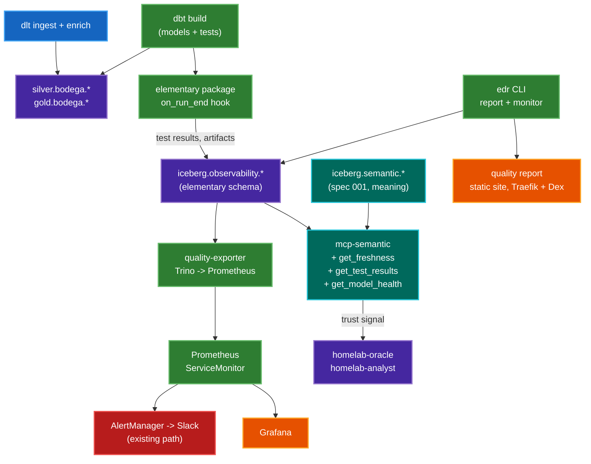

# Data Quality + Lineage — Design Spec

> **Second spec.** The first is
> [`002-01-semantic-layer.md`](002-01-semantic-layer.md), referred to throughout as
> **spec 001** — its registry (`iceberg.semantic.*`) and its `mcp-semantic`
> server are what this one extends. The third is
> [`002-02-semantic-layer-location.md`](002-02-semantic-layer-location.md), which adds a
> phase to spec 001 and is independent of this one. Project background is
> [`001-bodega-spec.md`](001-bodega-spec.md).
>
> **Numbering:** filenames carry the file number, the prose carries the logical
> one — this is **spec 002** in text and `003-` on disk.

---

## 0. Gate findings — read first

Two gates were set before this spec was allowed to have a plan. Both are
settled. The evidence is here because the answers changed the plan.

### Gate 1 — Elementary on dbt-trino: **PASS. Elementary path taken.**

| Check | Finding | Source |
|-------|---------|--------|
| Adapter listed | Trino is one of 11 warehouses with an install extra. `pip install 'elementary-data[trino]'` | [docs.elementary-data.com/oss/cli-install](https://docs.elementary-data.com/oss/cli-install) |
| PyPI extras | `provides_extra` on `elementary-data` 0.25.1 contains `trino` verbatim | [pypi.org/project/elementary-data](https://pypi.org/project/elementary-data/) |
| Macro dispatch | **28 `trino__` macros** in `macros/` — more than Snowflake (21) or Databricks (13). Covers `create_table_as`, `insert_rows`, `has_temp_table_support`, `incremental_strategy`, `datediff`, `cast_column`, `get_columns_from_information_schema` | [elementary-data/dbt-data-reliability](https://github.com/elementary-data/dbt-data-reliability) |
| CI | Trino is in `.github/workflows/test-warehouse.yml`, with `integration_tests/docker-compose-trino.yml` and a `trino_target` profile macro pointed at **`database: iceberg`** | same repo |
| Provenance | Support merged 2024-04 (`dbt-data-reliability#652`, `elementary#1378`), maintainer `haritamar`, with the dbt-trino PM participating | [elementary#739](https://github.com/elementary-data/elementary/issues/739) |
| Version floor | package `elementary` 0.25.1, `require-dbt-version: [">=1.0.0", "<3.0.0"]`. We are on `dbt-core>=1.9,<2.0` — inside the range | [hub.getdbt.com](https://hub.getdbt.com/elementary-data/elementary/latest/) |

Trino support is not marginal, and it is CI-tested **against Iceberg**, which
is our exact configuration. The fallback path (hand-rolled `run_results.json`
loader, Soda Core as alternate executor) is **not** taken. It is recorded in
§11 so the reasoning is not re-derived.

Three caveats that survive the pass, all Iceberg-specific and all closed
upstream but worth reading before Phase 1:

| Issue | What | State |
|-------|------|-------|
| [elementary#1835](https://github.com/elementary-data/elementary/issues/1835) | Large metadata folders, dbt-trino **with Iceberg** — our exact stack | closed |
| [dbt-data-reliability#998](https://github.com/elementary-data/dbt-data-reliability/issues/998) | Trino: `result_rows` / `failed_row_count` NULL for failed rows despite `store_failures` | closed; fixing commit not traced into 0.25.1 `[UNVERIFIED]` |
| [elementary#1661](https://github.com/elementary-data/elementary/issues/1661) | Temp tables not excluded from monitoring | closed |

#998 is the one that bites this spec directly: §7's alert routing wants a
failed-row count. Phase 1's done-when asserts it is non-NULL on our Trino
rather than trusting the closure.

**Correction to a common assumption, verified in source at tag 0.25.1:** you do
**not** add Elementary's `on-run-end` hook to `dbt_project.yml`. The package
ships its own:

```yaml
on-run-start:
  - "{{ elementary.on_run_start() }}"
on-run-end:
  - "{{ elementary.on_run_end() }}"
```

dbt runs a package's hooks automatically. Adding them again double-executes
artifact upload. There is no `upload_dbt_artifacts()` macro in 0.25.1. The
brief for this spec asked for "the dbt package install **and** `on-run-end`
hook" as one task — the hook half does not exist, and WF-1 says so.

### Gate 2 — how much of the marts layer is not dbt: **0%. Lineage stays at the back.**

Counted from `workflows/dbt/projects/bodega/models/` and
`workflows/dlt/projects/bodega/`:

| Producer | Objects | Share of marts |
|----------|---------|----------------|
| dbt | 4 silver + 6 gold = **10 models** | **10/10 = 100%** |
| Spark | **0** | 0% |
| dlt | 2 pipelines, neither producing a mart (below) | 0% |

**There is no Spark anywhere in `workflows/`.** A repo-wide search for
`spark` across `.py`/`.yaml`/`.yml` returns nothing. The public services page
lists Apache Spark as a data-stack component and the roadmap's foundations
table names it, but no workflow in this repo submits a Spark job. That is a
contradiction between the docs site and the repo; **the repo wins**, and
INFRA-9 fixes the page.

The dlt pipelines are real but sit *outside* the mart layer:

| Pipeline | Writes | Layer |
|----------|--------|-------|
| `bodega/ingest.py` | `bronze.bodega.raw_invoices` | bronze — not a consumer layer, by standing rule |
| `bodega/enrich.py` | `silver.bodega.products` | silver, but a **dbt `source`**, not a model |

`enrich.py` is the interesting one and the reason this gate was not a formality.
It writes `silver.bodega.products` *between* `dbt_silver` and `dbt_gold` in
`bodega_daily`, and `models/sources.yml` declares it as source
`bodega_enrich.products`. So there is exactly **one non-dbt writer inside the
dbt DAG's own dependency chain**, and Elementary sees it only as a source —
it can test its freshness and volume, but cannot attribute a failure to the
dlt run that caused it.

That is one edge, not a meaningful share. **The OpenLineage phase stays at the
back of the plan (Phase 5).** The brief's condition for moving it to the front
— "a meaningful share of marts written by Spark or dlt" — is not met at 0%.

Two consequences recorded rather than deferred silently:

1. The single dlt→dbt seam is covered in Phase 2 by a **source freshness check
   plus a volume anomaly test on `bodega_enrich.products`** (WF-4). That is the
   90% of the lineage value for this seam at none of the cost.
2. If a second domain lands with a Spark or dlt writer producing marts
   directly, re-run this count. The phase order is a function of the number,
   not a preference.

---

## 1. Context

### 1.1 Where the platform is today

The lakehouse runs end to end and spec 001 gave it a semantic layer. What
neither gave it is a way to know whether the numbers are *good*.

`bodega_daily` runs `n8n → dlt ingest → dbt silver → dlt enrich → dbt gold` at
08:00 UTC daily. dbt builds 10 models into Iceberg over Polaris. Trino queries
them, Superset charts them, and `mcp-semantic` compiles metrics against them
for `homelab-oracle`.

Testing today, counted from `workflows/dbt/projects/bodega/models/schema.yml`:

| What | Count | Detail |
|------|-------|--------|
| `not_null` tests | 12 | across silver and gold |
| `unique` tests | 2 | `invoices.invoice_number`, one gold key |
| **Total dbt tests** | **14** | all built-in generic, all on 10 models |
| Source freshness | **0** | no `freshness:` or `loaded_at_field` in `sources.yml` |
| `on-run-end` hooks | **0** | none in any of the three dbt projects |
| dbt packages | **0** | no `packages.yml` exists in any project |
| Historical test results | **none** | `dbt build` prints to stdout; the Airflow pod is deleted; nothing is retained |

`persist_docs` is already on and load-bearing — the semantic MCP server reads
Iceberg column comments as its documentation gate, and a blank description is
indistinguishable from an undocumented column. A test in
`workflows/dbt/tests/bodega/test_project.py` already fails the build on a blank
description. That is the one piece of data governance this platform enforces
today, and it is a precedent worth naming: **the enforcing mechanism is a CI
test, not a convention.** This spec extends that pattern rather than inventing
one.

### 1.2 The problem

Three gaps, in descending order of how much they cost.

**A number cannot say how much to trust it.** Spec 001's `query` returns
`excludes_applied`, `is_partial_period` and `registry_version` — everything
about what the metric *means*, nothing about whether the data behind it
arrived. If `dlt_ingest` fails at 08:05, `gold.bodega.spending_by_day` still
answers, with yesterday's data, and the answer is indistinguishable from a
fresh one. `homelab-oracle` will report it with total confidence. This is the
same failure class the fleet has hit repeatedly — `endpoint-warden` filling a
mandatory column from the wrong metric, `sre-sentinel` reporting a cumulative
counter as a state — and the fix is the same shape: **make absence expressible
in the tool result**, not a rule in the prompt.

**A test result exists for the length of one pod.** `dbt build` runs in a
Kubernetes pod that is deleted on completion. There is no history, so no
question about *trend* is answerable: is this test newly failing, or has it
failed for a week? Did row count drop today, or has it been drifting? Every
"is this normal" question needs a baseline that nothing is keeping.

**Nothing distinguishes "pipeline broken" from "data suspicious."** These need
different responses — one is an Airflow retry, the other is a look at the
source — and today both present identically: a number that looks fine.

### 1.3 Why quality and lineage are one spec

They are separable in principle and were nearly split. They ship as one
document for two reasons.

They answer halves of the same question. Quality says *this table is wrong*.
Lineage says *and here is what else is therefore wrong*. Either alone leaves
the operator doing the other half by hand — and with 10 models and one operator
the by-hand version of lineage is a `dbt docs` graph, which is why lineage is
Phase 5 and gated rather than dropped.

More practically: the join between them is a **facet on a lineage event**
(`DataQualityAssertionsDatasetFacet`, §10.4). Deciding the quality data model
without knowing what the lineage phase needs from it is how you write a second
migration. Specifying both now costs a section and saves a rewrite.

### 1.4 Where this must not create a second source of truth

Spec 001 was explicit that meaning lives in one place. This spec adds tables
that describe models, columns and tests — which is exactly the territory a
metadata catalog wants to own, and exactly why OpenMetadata and DataHub Core
are rejected in §11.

The rule, stated once and enforced structurally in §6.4:

> `iceberg.semantic.*` owns **what a number means**. Elementary owns **whether
> the data behind it arrived and looked normal**. Elementary never defines a
> metric, an owner or a description; the registry never stores a test result.

Elementary's `dbt_models.description` column is where this could quietly break,
since it ingests dbt descriptions and would then hold a second copy of text the
semantic registry resolves. §6.4 resolves it: that column is read-only
downstream, no tool exposes it, and the registry keeps resolving descriptions
from the dbt manifest exactly as spec 001 §4.3 specifies.

---

## 2. Goals

| #  | Goal | Acceptance signal |
|----|------|-------------------|
| G1 | Every agent answer can carry a trust signal | `get_model_health` returns a state for every model backing a registry metric; the eval set in AI-5 fails if a stale number is reported as fresh |
| G2 | Test results outlive the pod that produced them | `elementary_test_results` in Trino has rows from a run whose Airflow pod is gone |
| G3 | A broken pipeline is distinguishable from suspicious data | Two eval cases, one of each, produce different agent answers |
| G4 | Contracts are enforced by CI, not review | A PR dropping a contracted column or breaching a declared SLA fails `quality-gate` with no cluster |
| G5 | Alerts reuse the existing path | Quality alerts arrive in the same Slack channel via AlertManager; no second alerting stack is deployed |
| G6 | Anomaly detection costs less than it saves | Anomaly tests run on ≤4 tables; added `dbt build` wall-clock stays under +3 min (measured in WF-5) |
| G7 | No second source of truth for meaning | No Elementary column describing *meaning* is exposed by any MCP tool (§6.4) |

### 2.1 Non-goals

- **Column-level lineage.** Elementary OSS gives table-level lineage within one
  dbt project; column-level is a paid Cloud feature. Stated plainly rather than
  implied — see §11.1.
- **ML-based anomaly detection.** Also Cloud. What OSS gives is z-score against
  a rolling window (`anomaly_sensitivity: 3` stddevs), which is a different and
  much dumber thing. §7.3 sizes it honestly.
- **Replacing the `iceberg.semantic` registry.** Non-negotiable; §6.4.
- **Agent-initiated remediation** — auto-backfill, auto-retry, auto-repair.
  Explicitly deferred. It depends on this spec landing first, because
  remediation without a trust signal is a bot that retries at random. Follow-up,
  not scope.
- **Multi-project / multi-tenant.** Single operator. One dbt project has
  quality coverage (`bodega`); `pi` and `example_db` are excluded and §7.1 says
  why.
- **A data catalog.** No search UI over datasets, no ownership registry, no
  glossary. §11.
- **Replacing Superset or `dbt docs`** for human exploration.
- **Real-time quality.** Checks run with the daily DAG.

---

## 3. Architecture



Two properties the diagram is drawn to make visible.

**No new stateful service.** `iceberg.observability.*` is Iceberg tables in the
existing warehouse, written by the dbt run itself. The only new *workloads* are
a static report site and a small exporter, both stateless. This is the same
argument that put the semantic registry in a file rather than a service, and
it is why Elementary was chosen over anything with its own database.

**Quality metadata and semantic metadata meet only inside `mcp-semantic`.**
They are separate stores with separate owners, joined at read time by one
server. Neither writes to the other. That is §6.4's resolution made
structural — the two cannot drift into each other because there is no path.

### 3.1 Layer responsibilities

| Layer | Component | Owns | Must not |
|-------|-----------|------|----------|
| Q1 | dbt tests + contracts | Assertions about data, in `schema.yml`, reviewed in git | Contain thresholds tuned to make a failing test pass |
| Q2 | `elementary` package | Writing results/artifacts to `iceberg.observability.*` | Define what a model means, or own a description |
| Q3 | `edr` CLI | Rendering the HTML report | Be the alerting path (§7.5) |
| Q4 | `quality-exporter` | Trino → Prometheus gauges | Interpret; it exports numbers, thresholds live in alert rules |
| Q5 | `mcp-semantic` quality tools | Serving trust signals to agents | Return raw rows, free-text SQL, or any "meaning" column |
| Q6 | Agent personas | Printing the trust signal they were handed | Decide freshness by rule, or infer staleness from a timestamp |
| L1 | OpenLineage emitters (Phase 5) | Emitting run events | Be load-bearing for quality — quality must work with lineage absent |

**Trust boundary: Q6 is untrusted.** Identical to spec 001 §3.1. The freshness
*decision* is made in Q5 and returned as a value the model prints; it is never
a rule the model applies. The fleet has a documented history of models
computing a state from a raw number and getting it backwards — the fill
inversion, the cumulative counter — and both were fixed by moving the
computation into code. `get_model_health` returns `state: "stale"`, never a
timestamp for the model to compare against `now()`, which it cannot do anyway
because nothing in this fleet returns the current time.

---

## 4. Data model

### 4.1 Where it lands

| Property | Value | Why |
|----------|-------|-----|
| Catalog | `iceberg.observability` — a **new Polaris catalog** | Sibling of `bronze`/`silver`/`gold`/`test`, added to `iceberg_catalogs` in `global.yaml.gotmpl` (INFRA-1) |
| Schema | `bodega_elementary` | Elementary appends `_elementary` to the target schema by convention |
| Config | `models: elementary: +schema: "elementary"` in `dbt_project.yml` | [quickstart-package](https://docs.elementary-data.com/data-tests/dbt/quickstart-package) |

A new catalog rather than a schema in `silver`, for the reason bronze is not a
consumer layer: these tables are pipeline bookkeeping. A separate catalog makes
`SEMANTIC_WAREHOUSE_SCOPES` continue to exclude them structurally, so no
semantic `ref()` can ever resolve to a test-result table.

### 4.2 Tables Elementary creates

29 models at 0.25.1, read from source at that tag. Not all matter to us.

**Incremental tables — these grow and need retention (§4.3):**

| Table | Content | Used by |
|-------|---------|---------|
| `elementary_test_results` | One row per test per invocation: status, failed count, sample rows | `get_test_results`, exporter, alerts |
| `dbt_run_results` | One row per node per invocation: status, execution time, rows affected | `get_model_health`, exporter |
| `dbt_invocations` | One row per `dbt` command: invocation id, target, selector, timings | joins everything to a run |
| `dbt_source_freshness_results` | `dbt source freshness` output | `get_freshness` |
| `data_monitoring_metrics` | Time series behind anomaly tests — row counts, null rates per bucket | anomaly baselines; **largest table** |
| `schema_columns_snapshot` | Column set per table per run | schema-change detection |
| `test_result_rows` | Sampled failing rows (`test_sample_row_count`, default 5) | report only — **never exposed to agents** (§6.4) |
| `dbt_models`, `dbt_sources`, `dbt_tests`, `dbt_columns`, `dbt_seeds`, `dbt_snapshots`, `dbt_metrics`, `dbt_exposures`, `dbt_groups` | dbt artifact mirror | report; `dbt_models.description` is the §6.4 hazard |
| `metadata` | Package metadata (materialized `table`) | — |

**Views — zero storage, derived:** `alerts_dbt_models`, `alerts_dbt_tests`,
`alerts_dbt_source_freshness`, `alerts_anomaly_detection`,
`alerts_schema_changes`, `metrics_anomaly_score`,
`anomaly_threshold_sensitivity`, `model_run_results`, `job_run_results`,
`seed_run_results`, `snapshot_run_results`, `monitors_runs`,
`dbt_artifacts_hashes`.

Note the `alerts_*` objects are **views, not tables** — a detail that matters
because §7.5 reads them directly rather than expecting `edr` to have populated
something.

### 4.3 What this spec adds

Elementary has no retention policy. On Iceberg that is a real cost
([elementary#1835](https://github.com/elementary-data/elementary/issues/1835) is
metadata bloat on exactly our stack), so retention is ours to add:

```sql
-- workflows/dbt/projects/bodega/macros/prune_observability.sql (WF-8)
-- Invoked by a weekly Airflow task, not an on-run-end hook: pruning on every
-- run costs a delete per invocation for a table read once a week.
DELETE FROM iceberg.observability.bodega_elementary.data_monitoring_metrics
WHERE  bucket_end < current_date - INTERVAL '90' DAY
```

| Table | Retention | Reason |
|-------|-----------|--------|
| `data_monitoring_metrics` | 90 days | Longest anomaly training window is 14 days ×7 for weekly seasonality = 98 → 90 is a deliberate trim, re-checked in WF-5 |
| `elementary_test_results` | 180 days | Trend questions ("failing for how long") need more than one season |
| `test_result_rows` | 30 days | Sampled data rows; shortest retention on purpose (§6.4) |
| everything else | none | Small, bounded by model count |

**No new tables of our own design.** An earlier draft had an
`iceberg.observability.sla` table holding the declared SLAs from §7.4. It is
cut: an SLA is a *declaration*, it belongs in git next to the model it
describes, and a table would be a second copy the CI gate would then have to
reconcile. SLAs live in `schema.yml` `meta:` and are read by `quality-gate`
from the manifest.

---

## 5. Components

| Component | Runs where | Footprint | New? |
|-----------|-----------|-----------|------|
| `elementary` dbt package | Inside the existing `dbt build` pod | +0 pods. Wall-clock cost measured in WF-5 | new dep |
| `iceberg.observability` catalog | Polaris + Garage S3 | ~50 MB/yr at current volume `[UNVERIFIED — measure in WF-5]` | new catalog |
| `edr report` task | Airflow K8s pod, weekly | ~300 MB RSS while running, then gone | new task |
| Report static site | `nginx-unprivileged` behind Traefik + Dex | ~20 MB RSS | new pod |
| `quality-exporter` | Deployment, scraped by Prometheus | ~60 MB RSS | new pod |
| `mcp-semantic` quality tools | Existing pod | +0 pods | extends |
| **Phase 1–4 total** | | **< 400 MB RSS steady state** | |
| Marquez + CNPG db (Phase 5) | amd64 node only | **~1.2 GiB** — justified in §10.3 | gated |

Phases 1–4 stay well under the 1.5 GiB bar. Phase 5 does not, which is one of
three reasons it is gated rather than planned.

---

## 6. Agent interface

Three new tools on `mcp-semantic`. Same style as spec 001 §5.1: small, closed
outputs, no SQL surface, every judgement made server-side.

### 6.1 Tool contract

| Tool | Input | Output | Notes |
|------|-------|--------|-------|
| `get_freshness` | `model?: str` | `[{model, state, last_loaded_bucket, expected_grain, age_buckets}]` | `state` ∈ `fresh` / `stale` / `unknown`. `age_buckets` is an integer count of grain periods, never a timestamp |
| `get_test_results` | `model?: str`, `status?: "fail"\|"warn"\|"all"` | `[{model, test_name, column, status, failed_rows, first_seen_run, consecutive_failures}]` | `consecutive_failures` is the "new vs chronic" signal — the `sre-sentinel` lesson applied to data |
| `get_model_health` | `model: str` | `{model, state, reasons[], last_run_status, freshness, failing_tests, anomalies}` | One-call summary. `state` ∈ `healthy` / `degraded` / `broken` / `unknown` |

`get_model_health` exists because the other two are the wrong shape for the
question an agent actually has. A model this size handed a freshness list and
a test list will not reliably combine them; handed a single `state` with
`reasons[]`, it prints them. Same reasoning that put `excludes_applied` in
spec 001's `query` result rather than in the prompt.

### 6.2 State derivation — server-side, table-driven

```python
# Ordered; first match wins. No prompt applies these.
def model_state(m: ModelHealth) -> str:
    if m.last_run_status == "error":              return "broken"
    if m.freshness_state == "stale":              return "broken"
    if m.failing_tests_severity_error > 0:        return "broken"
    if m.failing_tests_severity_warn > 0:         return "degraded"
    if m.anomalies_flagged > 0:                   return "degraded"
    if m.last_run_at is None:                     return "unknown"
    return "healthy"
```

`broken` vs `degraded` is exactly G3: `broken` means the pipeline did not
deliver — retry it. `degraded` means it delivered something that looks odd —
look at it. `unknown` is a first-class state and never silently becomes
`healthy`; the `endpoint-warden` lesson is that absence must be expressible or
it gets filled in with the nearest available number.

### 6.3 Guardrails

| Control | Implementation |
|---------|----------------|
| No SQL surface | Same as spec 001 — no `run_sql`, absent rather than gated |
| Reachable schemas | `SEMANTIC_WAREHOUSE_SCOPES` gains `observability.bodega_elementary`; the compiler still refuses a `ref()` to it, because it is not in the registry's model scope |
| Byte budget | 4 KB per result, truncated by whole lines. `get_test_results` on a bad day could return 30 rows — it truncates and says so |
| No sample rows | `test_result_rows` is **never** exposed (§6.4) |
| Read-only | Trino `mcp` user is already read-only in `rules.json`; the new catalog must be added to its rule (INFRA-2) or every call returns a denial |
| Cache | 60 s TTL. The underlying data changes once a day; the tools are called in a loop |

**The Trino rules change needs a coordinator restart, not a refresh.** Spec 001
§5.4 records this the hard way: `security.refresh-period=60s` does not reload
`rules.json`. Check the coordinator pod's age before believing a denial from
these tools.

### 6.4 Second-source-of-truth resolution

Flagged as required. Three collisions exist; all three resolve to the same
rule, enforced structurally.

| Collision | Resolution | Enforced by |
|-----------|-----------|-------------|
| `dbt_models.description` mirrors the dbt description the semantic registry resolves from the manifest | The column is written by Elementary and read by nothing. **No MCP tool selects it.** Registry keeps resolving from the manifest per spec 001 §4.3 | Tool output schemas in §6.1 have no description field; a test asserts none of the three tools' SELECT lists name a description column (AI-4) |
| `dbt_columns` mirrors the column docs the semantic gate reads from Iceberg comments | Same — read by the report only | as above |
| Elementary "owns" model metadata in the way a catalog would | It does not: nothing consumes its metadata mirror except the HTML report, which is a human artifact with no write path | Structural — the report is a static file |

The rule, once: **Elementary's mirror of dbt metadata is an implementation
detail of its own report. The manifest remains the only source for meaning,
and `iceberg.semantic.*` the only source for metric definitions.** If a future
phase wants to expose descriptions to agents, it reads the manifest, not
Elementary.

### 6.5 Persona changes

| Persona | Change | Why |
|---------|--------|-----|
| `homelab-oracle` | +3 tools in `toolPolicy.allow` **and** in `mcpServers[].toolsAllow` | The two lists drift silently and cost prompt budget; spec 001 and MEMORY.md both say diff them by hand |
| `homelab-analyst` | Same 3 tools, if it has split out per spec 001 §6.2 | May not exist yet — AI-3 handles both cases |
| Prompt rule | "Before reporting a bodega number, call `get_model_health`. Print its `state` and `reasons` verbatim. Never infer freshness from a date." | The model prints a value; it does not apply a rule |

Prompt text must be ASCII-only inside indented blocks — a non-ASCII character
in an indented block has broken `status.result` before, via protobuf refusing
to marshal invalid UTF-8. Check with `grep -nP '^\s+.*[^\x00-\x7F]'`.

**Prompt budget:** +3 tool schemas at ~670 tokens each ≈ +2 KB per call, paid
on every call in the loop. `homelab-oracle` is on OpenRouter, not the 65,536
Ollama window, so this is affordable — but AI-3 measures first-call input
tokens before and after regardless, because that is the only way anyone has
ever caught this going wrong.

---

## 7. Quality strategy

### 7.1 Scope: `bodega` only

| Project | Covered | Why |
|---------|---------|-----|
| `bodega` | **yes** | Real data, real consumers (Superset, `mcp-semantic`, the digest) |
| `pi` | no | Monte Carlo π estimator. Its "correctness" is a convergence property, not a data property |
| `example_db` | no | Fixture for integration tests; already asserted by `tests/example_db/test_integration.py` |

### 7.2 Tests by model tier

| Tier | Models | Tests | Rationale |
|------|--------|-------|-----------|
| **Source** | `bronze.raw_invoices`, `silver.products` (dlt-written) | `freshness` (warn 26h, error 50h); `not_null` on the join key | 26h = daily cadence + 2h slack. The `products` freshness is the Gate-2 dlt seam |
| **Silver** | `invoices`, `invoice_items`, `invoice_taxes`, `stores` | Existing 14 tests **kept**; + `unique` on `(invoice_number, item_position)`; + `relationships` items→invoices; + `accepted_values` on `unit` (`KG`, `EA`) | Silver is where a join breaks quietly. `invoice_items` is the fan-out table — 85 invoices become 1,682 line items, and nothing currently asserts that expansion is sane |
| **Gold** | 6 marts | `not_null` on every dimension used as a `group_by` in the semantic registry; row-count floor per §7.4 | Driven by the registry: a gold column a metric groups by, going NULL, is a wrong chart with no error |
| **Anomaly** | 4 tables only | §7.3 | Compute cost |

The gold rule is the useful one and it is mechanical: **every dimension
declared in `workflows/dbt/semantic/bodega.yaml` gets a `not_null` test on its
backing column.** WF-3 derives the list from the registry rather than hand-
maintaining it, which keeps the two from drifting the way `toolPolicy` and
`toolsAllow` do.

### 7.3 Anomaly tests — where they earn their compute

Elementary's OSS anomaly detection is **z-score against a rolling window**, not
ML. Confirmed defaults from `default__get_default_config()` in source at 0.25.1:

| Var | Default | Meaning |
|-----|---------|---------|
| `days_back` | 14 | training window (alias: `training_period`) |
| `backfill_days` | 2 | detection window (alias: `detection_period`) |
| `anomaly_sensitivity` | 3 | stddevs (alias: `sensitivity`) |
| `min_training_set_size` | 7 | below this, no verdict |
| `time_bucket` | `{period: day, count: 1}` | |
| `anomaly_direction` | `both` | |

**`min_training_set_size: 7` is the binding constraint.** With ~85 invoices
total and a daily DAG, several of these tables have single-digit daily row
counts. A z-score over 14 daily buckets of a sparse series is noise, and a
noisy test that fires weekly is worse than no test — that is the `sre-sentinel`
chronic-alert lesson, and the `endpoint-warden` permanent-finding lesson, in
advance.

So anomaly tests go on **4 tables**, all with enough volume, all with a weekly
bucket:

| Table | Test | Config |
|-------|------|--------|
| `bronze.raw_invoices` (source) | `elementary.volume_anomalies` | `timestamp_column: _ingested_at`, `time_bucket: {period: week, count: 1}` |
| `silver.invoice_items` | `elementary.volume_anomalies` | the fan-out table; a collapse here is the highest-value catch |
| `silver.invoices` | `elementary.freshness_anomalies` | `timestamp_column: invoice_date` |
| `silver.products` | `elementary.schema_changes` | dlt-written; schema is not under dbt's control |

Verified as real test names at 0.25.1: `volume_anomalies`,
`freshness_anomalies`, `schema_changes`, `all_columns_anomalies`,
`column_anomalies`, `dimension_anomalies`, `event_freshness_anomalies`,
`schema_changes_from_baseline`, plus `table_anomalies`, `volume_threshold`,
`data_freshness_sla`, `execution_sla`.

**`all_columns_anomalies` is deliberately not used.** It generates a metric
series per column per bucket; on `invoice_items` that is ~20 columns of z-score
over a table with single-digit daily rows. Cost with no signal.

**Seasonality trap:** with `seasonality: day_of_week` or `hour_of_week`,
`days_back` is silently multiplied by 7. A 14-day window becomes 98 days of
`data_monitoring_metrics`. This is why §4.3 retention is 90 days and why WF-5
re-checks it — if seasonality is ever enabled, retention must move first or
the training window is truncated by the prune job. That interaction is silent
in both directions.

### 7.4 Contracts

A contract here is two halves, both in `schema.yml`, both enforced by CI.

**Half 1 — dbt model contracts** (native, no package):

```yaml
models:
  - name: invoices
    config:
      contract: {enforced: true}
    columns:
      - name: invoice_number
        data_type: varchar
        constraints: [{type: not_null}]
```

`contract.enforced` makes dbt fail at compile time if the model's actual column
set or types drift from the declaration — before any data is written. That is
the cheap half and it needs no cluster.

**Half 2 — a declared SLA** in `meta:`, which is ours, not Elementary's:

```yaml
models:
  - name: spending_by_day
    meta:
      sla:
        freshness_hours: 26
        min_rows: 30
        max_null_rate: {store_name: 0.01}
```

Enforced by `quality-gate` (WF-7), a CI step in the same spirit as
`semantic-compile`:

| Check | Cluster needed? |
|-------|-----------------|
| Every model backing a registry metric declares an `sla` block | no — manifest only |
| `contract.enforced: true` on all 6 gold models | no |
| `min_rows` ≤ current row count | yes — warns and skips offline |
| Every registry `group_by` dimension has a `not_null` test | no |

Three of four run offline, which matters: spec 001's gate runs in CI with no
warehouse and that property is what makes it get run.

### 7.5 Alert routing

**Reuse AlertManager → Slack. `edr monitor` is not used for alerting.**

The brief allowed either. `edr monitor` sends its own Slack messages on its own
schedule with its own formatting and its own credential — a second alerting
stack in everything but name, which the constraints forbid. Instead:

```
elementary_test_results  ->  quality-exporter  ->  Prometheus  ->  AlertManager  ->  Slack
       (Trino)                (gauge, 5m)          (alert rule)     (existing)
```

Every property that makes this the right call is a property the existing path
already has: dedup, grouping, silencing, an escalation policy, and one place to
mute during maintenance. Robusta and n8n already land there.

| Alert | Expression | Severity |
|-------|-----------|----------|
| `BodegaModelBroken` | `dbt_model_state{state="broken"} == 1` for 15m | critical |
| `BodegaSourceStale` | `dbt_source_freshness_age_hours > 50` | critical |
| `BodegaTestFailing` | `dbt_test_failures_total > 0` for 1h | warning |
| `BodegaAnomalyDetected` | `dbt_anomaly_flagged == 1` | warning |
| `BodegaQualityExporterDown` | `up{job="quality-exporter"} == 0` for 15m | warning |

The last one is not filler. Without it, the exporter dying looks exactly like
everything being healthy — every gauge simply absent. This is the fleet's
recurring failure shape (a wrong Prometheus URL reporting every metric
`unavailable`, an MCP server 404ing with `status.ready: true`) and it is
cheaper to prevent here than to diagnose later.

n8n formats the Slack message (WF-9) using the same webhook it already holds.
No new credential.

---

## 8. Observability

### 8.1 Prometheus metrics

Exported by `quality-exporter`, which queries Trino every 5 minutes. **All
names below are ours** — Elementary ships no Prometheus exporter (confirmed:
no such surface in the package or CLI), so nothing here is an upstream name
being quoted.

| Metric | Type | Labels |
|--------|------|--------|
| `dbt_model_state` | gauge (0/1) | `model`, `state` |
| `dbt_test_failures_total` | gauge | `model`, `test_name`, `severity` |
| `dbt_test_consecutive_failures` | gauge | `model`, `test_name` |
| `dbt_source_freshness_age_hours` | gauge | `source`, `table` |
| `dbt_model_last_run_timestamp_seconds` | gauge | `model` |
| `dbt_model_execution_seconds` | gauge | `model` |
| `dbt_model_rows_affected` | gauge | `model` |
| `dbt_anomaly_flagged` | gauge (0/1) | `model`, `anomaly_type` |
| `dbt_invocation_duration_seconds` | gauge | `target`, `status` |
| `quality_exporter_scrape_errors_total` | counter | `reason` |

`dbt_test_consecutive_failures` is the new-vs-chronic signal that the
`sre-sentinel` chronic-alert work established was necessary. Without it, a
test that has failed for a month and one that failed this morning are the same
alert.

Note `dbt_model_state` is a 0/1 gauge with a `state` label rather than an
enum-valued gauge, so `dbt_model_state{state="broken"} == 1` works as an alert
expression. And these are all **gauges read from a table**, not counters — the
`cnpg_pg_stat_archiver_failed_count` lesson says a suffix does not tell you
which is which, so the type is stated per row above and asserted in the
exporter's tests.

### 8.2 ServiceMonitor

Follows the existing convention (`polaris.yaml.gotmpl`, `garage.yaml.gotmpl`,
`ollama.yaml.gotmpl` all declare one). `releases/data/helmfile.yaml.gotmpl`
already lists `monitoring.coreos.com/v1/ServiceMonitor` in `apiVersions`, so
the CRD is available at render time and no chart change is needed for that.

### 8.3 Grafana panels

One dashboard, `Data Quality — bodega`, as JSON in
`releases/data/files/dashboards/` per existing convention.

| Panel | Query | Why |
|-------|-------|-----|
| Model state | `dbt_model_state` as a state-timeline | The one-glance answer |
| Freshness age vs SLA | `dbt_source_freshness_age_hours` with a threshold line | |
| Failing tests, by consecutive count | `topk(10, dbt_test_consecutive_failures)` | Separates chronic from new — the most useful panel here, same as "rejections by reason" was in spec 001 |
| dbt run duration | `dbt_model_execution_seconds` | Catches the anomaly-test compute cost (G6) |
| Rows affected | `dbt_model_rows_affected` | A volume collapse is visible before a test catches it |

### 8.4 Loki

`quality-exporter` logs one structured line per scrape: query, row count,
duration, outcome. The `mcp-semantic` quality tools log per call, matching
spec 001 §5.5: caller, tool, args, result summary, duration.

The standing constraint applies — tool *results* are logged nowhere by the
Sympozium runtime, so this is the only way to see what the model saw when it
reports something odd.

---

## 9. Report hosting

`edr report` produces a single self-contained `elementary_report.html`
(typical size `[UNVERIFIED]` — measured in WF-6).

| Decision | Choice | Why |
|----------|--------|-----|
| Generation | Weekly Airflow task after `bodega_daily` | Not per-run; nobody reads it daily |
| Storage | Garage S3, `datahub-local-temp` | Bucket exists |
| Serving | `nginx-unprivileged` + `app-template` chart, behind Traefik + Dex SSO | Matches every other internal UI |
| Refresh | initContainer pulls latest from S3 on start; CronJob restarts weekly | Static file, no state |
| Arch | arm64 — `nginx-unprivileged` is multi-arch | no node pinning |

**Not GitOps-clean, and flagged rather than accepted:** the report is a
generated artifact whose content is not in git. The mitigation is that it is
*derived* — regenerable from `iceberg.observability.*` by rerunning `edr` — and
it is read-only, with no configuration set through it. Nothing about the
platform's state is changed by, or recoverable only from, this UI. If that
stops being true, the report goes.

**`edr` on arm64 is an open question.** `elementarydata/elementary` on Docker
Hub returns **404 — the image does not exist** (verified directly; a prior
research pass assumed it did). So `edr` runs from PyPI in a Python image, not
from a vendor image. `elementary-data` 0.25.1 requires `>=3.10,<3.14` and the
pinned `python` image in `_version.yaml` is **`"3.14"` — out of range**. WF-6
must pin 3.13 explicitly. This is the kind of detail that fails at 08:00 on a
Sunday.

---

## 10. Lineage phase (Phase 5, gated)

### 10.1 The gate

Gate 2 returned 0% non-dbt marts, so lineage is **not** required now. It
proceeds only if one of these becomes true:

1. A second domain lands with a Spark or dlt writer producing marts directly.
2. Cross-system lineage is needed for something concrete — a Superset chart
   traced to a source, an impact analysis before a schema change.
3. `dbt docs`' own DAG view proves insufficient in practice, demonstrated with
   an actual question it could not answer.

Absent those, `dbt docs` covers table-level lineage within the project for free.

### 10.2 Emitters

| Emitter | Package / config | Status |
|---------|-----------------|--------|
| Airflow | `apache-airflow-providers-openlineage` **2.20.1** (2026-08-23), `requires apache-airflow>=2.11.0` — we run **3.3.1**, so the floor is satisfied and no upper bound is declared. Config: `AIRFLOW__OPENLINEAGE__TRANSPORT` (a JSON string), `__NAMESPACE`, `__DISABLED` | PyPI + [config ref](https://airflow.apache.org/docs/apache-airflow-providers-openlineage/stable/configurations-ref.html). Explicit 3.3.x support is **not documented** — permitted by metadata, not stated `[UNVERIFIED]` |
| dbt | `openlineage-dbt` **1.53.0** (`dbt-ol` wrapper) | **Trino confirmed** — `Adapter.TRINO` is in the supported enum in `processor.py`; namespace maps to `trino://<host>:<port>`. `DUCKDB` is in the same enum, so the local target works too |
| Trino | **Native since Trino 449** (May 2024); **450 is the first usable release** — 449 shipped with a listener load bug, fixed in 450, and OpenLineage's own integration page states "known to work with Trino 450 and later". **We run 479** (chart `trino/trino` 1.42.2 → `appVersion: "479"`), so the floor is met with margin. `event-listener.name=openlineage` | [Trino 449](https://trino.io/docs/current/release/release-449.html), [450](https://trino.io/docs/current/release/release-450.html), [OpenLineage Trino integration](https://openlineage.io/docs/integrations/trino/) |
| Spark | n/a — no Spark in this repo (Gate 2) | — |

Trino's listener, documented minimal config:

```properties
# etc/openlineage-event-listener.properties
event-listener.name=openlineage
openlineage-event-listener.trino.uri=http://trino-coordinator:8080
openlineage-event-listener.transport.type=HTTP
openlineage-event-listener.transport.url=http://marquez:5000
```

registered via `event-listener.config-files` on the coordinator.
Source: [trino.io/docs/current/admin/event-listeners-openlineage.html](https://trino.io/docs/current/admin/event-listeners-openlineage.html)

The Airflow side takes its transport as a **JSON string**, not discrete keys:

```bash
AIRFLOW__OPENLINEAGE__TRANSPORT='{"type": "http", "url": "http://marquez:5000", "endpoint": "api/v1/lineage"}'
AIRFLOW__OPENLINEAGE__NAMESPACE='datahub-local'
```

Do not build config on `disabled_for_operators` or `selective_enable` — both are
**deprecated** in favour of `emission_policy`.

Version headroom is comfortable and worth stating so it is not re-checked:
Trino 479 also carries 477's user fields on the `trino_query_context` facet and
479's lineage for `SELECT` output columns. Neither is needed here, but both
mean the listener is being used well inside its supported range rather than at
its floor. Re-check only if the Trino chart is ever pinned backwards.

**Two traps, both silent, both must be in the PR description:**

1. `openlineage-event-listener.transport.type` defaults to **`CONSOLE`**. A
   misconfigured listener logs to coordinator stdout and sends nothing, with no
   error. Identical shape to the `mcp-k8s` transport failure that hid missing
   tools behind `status.ready: true`.
2. `openlineage-event-listener.trino.include-query-types` defaults to
   `DELETE,INSERT,MERGE,UPDATE,ALTER_TABLE_EXECUTE` — **`CREATE_TABLE_AS_SELECT`
   is absent.** Our dbt models are `+materialized: table`, which on Trino is
   CTAS. Under defaults this listener emits **nothing at all for our entire dbt
   project.** Must be set explicitly.

### 10.3 Marquez footprint — and the arm64 blocker

| Property | Value | Source |
|----------|-------|--------|
| Latest | **0.51.1**, tagged 2025-03-27 (~18 months old) | git tags |
| GitHub Releases | stuck at 0.50.0 — 0.51.x never cut as a Release | releases API |
| Last commit to `main` | 2026-04-12 | commits API |
| Helm chart | **git checkout only** — no chart repo, no `.tgz` assets, no official ArtifactHub entry | verified |
| Chart deps | Bitnami `common` 2.1.2 (unconditional) + `postgresql` 11.8.1 (conditional) | `Chart.yaml` |
| Postgres | **14** required | README `## Requirements` |
| External DB | `postgresql.enabled: false` (already default) + a `marquez.db:` block; secret key must be `marquez-db-password` | `_helpers.tpl` |
| Resources | `limits: {}` / `requests: {}` — **ships with none**, BestEffort QoS, no `-Xmx` anywhere | `values.yaml`, Dockerfile |
| **arch** | **amd64 only — all 165 tags, both images** | below |

arm64 verified three independent ways: Docker Hub tag API across every
published tag of `marquezproject/marquez` (95) and `marquez-web` (70); registry
manifest API showing `manifest.v2+json` rather than a multi-arch index, so arch
negotiation is not even possible; and the image config blob reporting
`architecture: amd64`. CI is plain `docker build` with no `buildx` and no
`--platform`, so the pipeline cannot produce arm64.
[MarquezProject/marquez#2804](https://github.com/MarquezProject/marquez/issues/2804)
is **open**.

Our cluster is arm64-majority — Trino, Superset, Polaris, Airflow and Kopia all
pin `kubernetes.io/arch: arm64`; only n8n's helpers and a media service pin
amd64. So Marquez means **node-pinning to amd64**, and it means owning the
Bitnami dependency problem (the public catalog moved to `bitnamilegacy` in
Aug 2025, so `--dependency-update` may simply fail).

Footprint: ~1 GiB for the API server (no documented figure; the commented-out
chart hint is the only number the project puts in writing, and it is inert)
plus a CNPG database. **~1.2 GiB total, over the 1.5 GiB bar only in
combination with everything else** — but the justification is not the number,
it is that a stale, amd64-only, chart-less service pinned to one node is a real
operational liability for one operator. Which is the fourth reason the gate
exists.

### 10.4 What lineage unlocks

The join between the two halves of this spec is
**`DataQualityAssertionsDatasetFacet`** — `$id`
`https://openlineage.io/spec/facets/1-1-0/DataQualityAssertionsDatasetFacet.json`,
an `InputDatasetFacet` whose required `assertions` array carries
`assertion`, `success`, `column`, `severity`, `name`, `description`,
`expected`, `actual`.

**Elementary emits no OpenLineage** — zero hits across the 0.25.1 package, and
its "lineage" feature is proprietary and unrelated to the standard. So the two
systems are disjoint, and Elementary is not the emitter.

**`openlineage-dbt` is.** Its `processor.py` builds
`DataQualityAssertionsDatasetFacet` from dbt test nodes via a `parse_assertions()`
method and writes it under `dataQualityAssertions`, aggregating a model's test
results to FAIL "when any of its assertions failed" with warn-severity
exclusions. So the join between quality and lineage comes free with WF-11 and
needs no emitter of our own — but note it carries **dbt's own test results, not
Elementary's tables**. The two views of the same test runs must not be allowed
to disagree; if Phase 5 ever proceeds, `elementary_test_results` stays the
source for §6 and the facet is display-only in Marquez.

---

## 11. Alternatives considered

### 11.1 Elementary Cloud

Rejected — paid, and the OSS/paid line matters for what this spec can promise.

| Feature | OSS | Cloud |
|---------|-----|-------|
| Test result storage in warehouse | yes | yes |
| Table-level lineage, one dbt project | yes | yes |
| **Column-level lineage** | **no** | yes |
| **ML anomaly detection** | **no** (z-score only) | yes |
| Hosted UI, RBAC, incident management | no | yes |

Stated plainly per the brief: **this spec delivers table-level lineage within
one dbt project and z-score anomaly detection. Not column-level lineage, not ML
detection.**

### 11.2 OpenMetadata

| Against | Detail |
|---------|--------|
| Elasticsearch | Required. Constraints forbid a new one — and it alone exceeds the 1.5 GiB bar |
| Owns metric definitions | Wants to be the source for metrics, ownership and descriptions — head-on collision with `iceberg.semantic.*` (§6.4) |
| Connector maintenance | Ingestion connectors break on source upgrades; one operator |
| No user-facing reason | The consumer here is an agent, which needs three tool calls, not a catalog UI |

### 11.3 DataHub Core

Everything above, plus Kafka, MySQL, GMS and a frontend — the heaviest option
by a distance, and Redpanda existing does not help since DataHub expects its
own topics and schema registry.

It also **collides by name with this project.** `datahub-local` deploying
DataHub would make every log line, chart title and directory name ambiguous.
Not the deciding factor, but not nothing either.

### 11.4 Marquez-only (lineage without quality)

Rejected as a starting point. Lineage without quality tells you what *would* be
affected if something were wrong, while never telling you that something is.
Quality without lineage is useful at 10 models; lineage without quality is not
useful at any size.

### 11.5 DIY — `run_results.json` loader

The Gate-1 fallback. Not taken, recorded so it is not re-derived: it is
structurally the same outcome (artifacts as warehouse tables) with more code to
own, no report, no anomaly tests, and no upstream. `brooklyn-data/dbt_artifacts`
2.11.0 does support Trino (15 `trino__` macros, CI-tested) and would be the
starting point if Elementary is ever abandoned. Soda Core is the alternate
executor — current package is **`soda-trino` 4.23.0** (released 2026-09-01), not
the stale `soda-core-trino` 3.5.6 — but it is a second test framework beside
dbt's, which is a worse shape than extending the one we have.

---

## 12. Implementation plan

**Repo-structure correction.** The brief specifies four repos —
`datahub-local-workflows`, `datahub-local`, `datahub-local-ai`, plus open
source. That is not the layout on disk:

| Brief | Reality |
|-------|---------|
| `datahub-local-workflows` (dbt, dags) | **does not exist.** dbt/Airflow/dlt/Superset are all in `datahub-local-ai/workflows/` |
| `datahub-local` | **`datahub-local-core`** — the Helm/ArgoCD repo |
| `datahub-local-ai` | exists, and is also the workflows repo |
| — | **`datahub-local-ai-mcp`** — MCP servers, a fourth repo the brief omits. This is where the new tools go |
| — | `datahub-local-secrets` — encrypted secrets |

Task prefixes below map to the **real** repos. `WF-*` means
`datahub-local-ai/workflows/`, not a separate repository.

### `datahub-local-ai` — workflows (`WF-*`)

**Phase 1 — Elementary lands, results persist**

- [ ] **WF-1** — `workflows/dbt/projects/bodega/packages.yml` (new file):
      `elementary-data/elementary` version `0.25.1`. Add
      `models: elementary: +schema: "elementary"` to `dbt_project.yml`.
      **Do not add `on-run-end`** — the package ships its own (§0 Gate 1).
      Add `dbt deps` to the dbt runner's pre-build step.
      *Blocked by `datahub-local-core`#INFRA-1, #INFRA-2.*
- [ ] **WF-2** — `workflows/dbt/src/dbt_runner/`: `--target homelab` writes to
      the `observability` catalog; verify `trino__get_default_config()`
      overrides land (it sets `query_max_size: 250000`).
- **Done when:** `elementary_test_results` has rows in Trino from a run whose
  Airflow pod is gone (G2), **and** `failed_row_count` is non-NULL for a
  deliberately-failed test — the #998 check, which the closure alone does not
  establish on our adapter.

**Phase 2 — Coverage and contracts**

- [ ] **WF-3** — `models/schema.yml`: silver + gold tests per §7.2. Gold
      `not_null` list **derived from** `workflows/dbt/semantic/bodega.yaml`
      dimensions, not hand-written.
- [ ] **WF-4** — `models/sources.yml`: `freshness` + `loaded_at_field` on both
      sources, including the `bodega_enrich.products` dlt seam (Gate 2).
- [ ] **WF-5** — anomaly tests on the 4 tables in §7.3. **Measure `dbt build`
      wall-clock before and after** (G6) and re-check the §4.3 retention window
      against the seasonality multiplier.
- [ ] **WF-6** — `workflows/airflow/dags/bodega_dag.py`: weekly `edr report`
      task → Garage S3. Pin **Python 3.13** — `elementary-data` 0.25.1 requires
      `<3.14` and `_version.yaml` pins `python: "3.14"` (§9).
- [ ] **WF-7** — `workflows/dbt/quality/gate.py` + CI: `quality-gate` per §7.4.
      Three of four checks run offline.
- [ ] **WF-8** — `macros/prune_observability.sql` + weekly Airflow task (§4.3).
- **Done when:** a PR dropping a contracted gold column fails CI with no
  cluster (G4).

**Phase 3 — Alerting**

- [ ] **WF-9** — n8n workflow for Slack formatting, reusing the existing
      webhook. *Blocked by `datahub-local-core`#INFRA-5.*
- **Done when:** a deliberately-failed test produces one Slack message through
  AlertManager, and silencing it in AlertManager silences it — proving the
  existing path owns it and no second stack was introduced (G5).

**Phase 5 — Lineage (gated, §10.1)**

- [ ] **WF-10** — `apache-airflow-providers-openlineage` 2.20.1 +
      `AIRFLOW__OPENLINEAGE__*`. *Blocked by #INFRA-10.*
- [ ] **WF-11** — `dbt-ol` wrapper (`openlineage-dbt` 1.53.0). Trino is a
      supported adapter (§10.2). This is also what emits
      `dataQualityAssertions` from dbt test results (§10.4) — prefer it over a
      hand-rolled emitter.
- **Done when:** a `bodega_daily` run appears in Marquez as a connected graph
  from source to gold, and one dbt test failure is visible on the dataset as a
  `dataQualityAssertions` entry.

### `datahub-local-core` — infra (`INFRA-*`)

**Phase 1**

- [ ] **INFRA-1** — `values/global.yaml.gotmpl`: add `observability` to
      `iceberg_catalogs`. The Trino initContainer creates the Polaris catalog
      and needs the matching `datahub-local-observability` S3 bucket.
- [ ] **INFRA-2** — `releases/data/values/trino.yaml.gotmpl`: grant `dbt`
      write and `mcp` read on `observability` in `rules.json`. **Then
      `kubectl rollout restart` the coordinator** — `security.refresh-period`
      does not reload the file. Do not believe a denial taken before the roll.
- **Done when:** `dbt` can create a table in `iceberg.observability` and `mcp`
  can select from it but not write — both verified *after* confirming the
  coordinator pod's age postdates the rules change.

**Phase 2–3**

- [ ] **INFRA-3** — report site: `app-template` release,
      `nginx-unprivileged`, Traefik ingress, Dex SSO, S3 initContainer (§9).
      arm64, no pinning.
- [ ] **INFRA-4** — `quality-exporter`: Deployment + Service + ServiceMonitor,
      following `polaris.yaml.gotmpl`'s serviceMonitor shape.
- [ ] **INFRA-5** — AlertManager rules per §7.5, including
      `BodegaQualityExporterDown`.
- [ ] **INFRA-6** — Grafana dashboard JSON in
      `releases/data/files/dashboards/` (§8.3).
- [ ] **INFRA-7** — NetworkPolicy: `quality-exporter` → Trino only.
- [ ] **INFRA-8** — secrets for the exporter's Trino identity via
      `datahub-local-secrets` only.
- **Done when:** the Grafana dashboard shows a state for all 10 models, and
  killing the exporter fires `BodegaQualityExporterDown` rather than rendering
  every model healthy.

**Phase 4 — docs**

- [ ] **INFRA-9** — `docs/services/data.md`: add a Data Quality section. **Fix
      two existing bugs found while researching this spec:** the page's Polaris
      card describes Nessie throughout and the Stack Overview mermaid wires an
      undeclared `Nessie` node while `Polaris` renders orphaned; and dbt/dlt
      appear nowhere despite the roadmap marking them Completed. Also drop or
      qualify Spark — no workflow in the repo submits a Spark job (Gate 2).
- [ ] **INFRA-10** — `docs/roadmap.md`: move this work into **In Progress**.
      The existing In Progress entry ("MCP Servers for AI Tooling") points at
      `datahub-local-ai/agents/mcp`, **a path that no longer exists**, and lists
      six planned servers against the two that shipped. Fix while there.
- **Done when:** the public docs describe the platform that exists — no Nessie
  under a Polaris heading, dbt and dlt present, Spark not claimed as a
  transformation path.

**Phase 5 — gated**

- [ ] **INFRA-11** — Marquez: vendored chart (no chart repo exists), external
      CNPG database, **`nodeSelector: kubernetes.io/arch: amd64`**, secret key
      `marquez-db-password`, Bitnami dependency vendored (§10.3).
- [ ] **INFRA-12** — Trino event listener: plugin config via
      `additionalConfigProperties` + `event-listener.config-files`. **Must set
      `transport.type=HTTP` and `include-query-types` to include
      `CREATE_TABLE_AS_SELECT`** (§10.2), or it silently emits nothing.
- **Done when:** Marquez receives an event from a CTAS query — not from the
  coordinator log, which is where a `CONSOLE` transport quietly succeeds.

### `datahub-local-ai-mcp` — agent tools (`AI-*`)

*The brief put these in `datahub-local-ai`; the MCP servers live in their own
repo. The spec document itself does belong in `datahub-local-ai`.*

- [ ] **AI-1** — `servers/semantic/`: `get_freshness`, `get_test_results`,
      `get_model_health` per §6.1, with the §6.2 state derivation in code.
      *Blocked by WF-1, WF-4.*
- [ ] **AI-2** — `SEMANTIC_WAREHOUSE_SCOPES` += the observability schema;
      byte budgets; 60 s cache; Prometheus + Loki instrumentation (§8).
      *Blocked by INFRA-2.*
- [ ] **AI-3** — (in `datahub-local-ai`) `homelab-oracle` — and
      `homelab-analyst` if split — gain the 3 tools in **both**
      `toolPolicy.allow` and `mcpServers[].toolsAllow`. Prompt rule per §6.5.
      Measure first-call input tokens before and after. ASCII-check indented
      blocks. Run `reseed_memory.py` if any seed changes.
- [ ] **AI-4** — test asserting no quality tool's SELECT list names a
      description column (§6.4, G7).
- [ ] **AI-5** — (in `datahub-local-ai`) eval cases: a stale model must not be
      reported as fresh; `broken` and `degraded` must produce different answers
      (G1, G3).
- [x] **AI-6** — this spec: `docs/specs/003-data-quality-and-lineage.md`.
      `docs/` is now a numbered `specs/` set; filenames carry the file number
      and the prose carries the logical one, so this file is **spec 002** in
      text and `003-` on disk. Keep that split when adding the next spec.
- **Done when:** asking the oracle a bodega question the morning after a
  deliberately-broken `dlt_ingest` gets an answer that says the data is stale.
  **This is the whole spec in one check** — if it passes and nothing else does,
  the project was still worth it.

### Open-source repos

**Nothing qualifies.** The one candidate was a `marquez-helm` chart, since no
official chart repo exists — but publishing a chart for an amd64-only,
18-month-stale service we have gated and may never deploy would be inventing a
deliverable for tidiness. If Phase 5 ever proceeds and the vendored chart proves
sound, revisit.

### 12.1 Cross-repo sequencing

| Wave | Tasks | Notes |
|------|-------|-------|
| 1 | INFRA-1, INFRA-2 | **Must land first.** Catalog + grants + coordinator restart |
| 2 | WF-1, WF-2 | Elementary writes; needs wave 1 |
| 3 | WF-3, WF-4, WF-5, WF-7, WF-8 ∥ INFRA-3, INFRA-4, INFRA-7, INFRA-8 | Parallel — tests and infra do not touch |
| 4 | AI-1, AI-2, AI-4 ∥ INFRA-5, INFRA-6 | Tools need data from wave 2 |
| 5 | AI-3, AI-5, WF-9 | Personas last — measure the token budget |
| 6 | INFRA-9, INFRA-10, AI-6 | Docs; any time after wave 3 |
| gated | WF-10, WF-11, INFRA-11, INFRA-12 | §10.1 |

**The ordering mistake most likely to waste a weekend:** landing WF-1 before
INFRA-2's Trino grant **and its coordinator restart**. `dbt build` will fail
partway through with a permission error on the observability catalog, after
having already written models — so the run is half-applied and the error names
a catalog rather than a rule file. Then, because
`security.refresh-period=60s` does not reload `rules.json`, adding the grant
appears not to fix it, and the natural next move is to start debugging the
grant syntax, which is correct. Spec 001 hit exactly this and the fix is in the
process, not the config: **check the coordinator pod's age before believing any
denial from this Trino.**

Runner-up: enabling anomaly seasonality (WF-5) without first widening the §4.3
retention window. `days_back` is silently multiplied by 7, the prune job then
truncates the training set, and the anomaly tests quietly return no verdict —
`min_training_set_size: 7` is not met, so nothing errors and nothing fires. A
detector that has silently stopped detecting looks exactly like a clean bill of
health.

---

## 13. Risks

| Risk | Mitigation |
|------|-----------|
| **Anomaly tests are noise at this data volume** — 85 invoices, single-digit daily rows, `min_training_set_size: 7` | Weekly buckets, 4 tables only, `all_columns_anomalies` excluded. If a test fires twice with no real cause, delete it — a permanent finding is a bug in the config, not a problem in the data |
| **Iceberg metadata bloat from Elementary temp tables** ([#1835](https://github.com/elementary-data/elementary/issues/1835), our exact stack) | `tests_use_temp_tables: false` is the 0.25.1 default; keep it. §4.3 retention. Polaris nightly compaction already runs |
| **Trino `failed_row_count` NULL** ([#998](https://github.com/elementary-data/dbt-data-reliability/issues/998)) | Phase 1's done-when asserts it on our adapter rather than trusting the closure |
| **Elementary's dbt-metadata mirror becomes a second catalog** | §6.4: no tool exposes a meaning column; AI-4 asserts it |
| **`edr` Python version** — package needs `<3.14`, `_version.yaml` pins `3.14` | WF-6 pins 3.13 explicitly. Would fail at first run, on a schedule, unattended |
| **`elementarydata/elementary` image does not exist** (404) | Run `edr` from PyPI in a pinned Python image. Do not write a values block referencing a vendor image |
| **Report is a non-GitOps artifact** | Derived and regenerable, read-only, sets no state. If configuration ever becomes settable through it, the report goes (§9) |
| **Prompt budget** — +3 schemas on every call in the loop | AI-3 measures before and after. OpenRouter, not the 65,536 Ollama window, so headroom exists |
| **Agent reports a stale number as fresh** — the failure this spec exists to prevent | State computed server-side (§6.2), returned as a value the model prints. `unknown` is a first-class state. AI-5 asserts it |
| **Marquez: amd64-only, 18 months stale, no chart repo, Bitnami deps possibly unresolvable** | Gated (§10.1). If it proceeds: vendored chart, node-pinned, external CNPG |
| **Trino listener silently emits nothing** — `CONSOLE` default, and CTAS missing from `include-query-types` | Both in INFRA-12's description; verify with a real event before closing |
| **Quality-exporter dies and everything looks healthy** | `BodegaQualityExporterDown`. The absent-metric failure has bitten this fleet repeatedly |
| **Alert fatigue moves quality alerts to a muted channel** | `consecutive_failures` separates chronic from new; warn/error severities are separate rules |

---

## 14. Open questions

1. ~~Does `dbt-ol` support the Trino adapter?~~ — **closed.** Yes;
   `Adapter.TRINO` is in the supported enum in `processor.py`, mapping to
   namespace `trino://<host>:<port>`, and `DUCKDB` is there too. It also emits
   `dataQualityAssertions` natively (§10.4), which removes a Phase 5 task.
   Recorded so it is not re-litigated.
2. **Is `failed_row_count` non-NULL on our Trino?** #998 is closed but the
   fixing commit was not traced into 0.25.1. **Settle by:** WF-1's done-when —
   one deliberately-failing test, then select the column.
3. **What does `edr report` actually cost?** HTML size and peak RSS both
   `[UNVERIFIED]`. **Settle by:** WF-6 measures on first run. If the file is
   large enough to matter, S3 already handles it.
4. **Does `homelab-analyst` exist yet?** Spec 001 §6.2 left it conditional on a
   token measurement. AI-3 handles both cases; the answer changes which persona
   files change, nothing else.
5. **Is 26h the right freshness warn threshold?** Daily at 08:00 UTC + 2h. The
   n8n Gmail step is the variable part. **Settle by:** two weeks of
   `dbt_source_freshness_age_hours` in Grafana before wiring the alert.
6. **Should Superset charts carry a trust signal too?** Agents get one; a human
   reading a dashboard does not. A "data as of / state" header panel is cheap.
   Deferred, not rejected.
7. **Does the `observability` catalog need its own S3 bucket?** Each Iceberg
   catalog has `default-base-location: s3://datahub-local-<name>`, so INFRA-1
   implies `datahub-local-observability`. Confirm against the Garage bucket
   provisioning path before INFRA-1, not after.

---

## 15. Definition of done

- `elementary_test_results` and `dbt_run_results` carry rows in Trino from runs
  whose pods are long gone (G2)
- `get_model_health` returns a state for every model backing a registry metric,
  and `unknown` is returned rather than assumed healthy when data is missing
- A stale model asked about in Slack is reported as stale, with the reason,
  verified by an eval case (G1)
- `broken` and `degraded` produce visibly different answers (G3)
- A PR dropping a contracted column or breaching a declared SLA fails
  `quality-gate` with no cluster running (G4)
- Quality alerts arrive in the existing Slack channel through AlertManager, and
  no second alerting stack exists (G5)
- `dbt build` wall-clock grew by less than 3 minutes (G6)
- No MCP tool exposes an Elementary column describing meaning; AI-4 asserts it
  (G7)
- The Elementary report is reachable behind Dex and refreshes weekly without
  hand-running anything
- `dbt_test_consecutive_failures` is visible in Grafana, because the first real
  question will be "is this new"
- The docs site no longer describes Nessie as Polaris, no longer omits dbt and
  dlt, and the roadmap no longer points at `agents/mcp`
- `agents/sympozium/MEMORY.md` gains the entry for whatever this breaks in
  production, because it will break something
