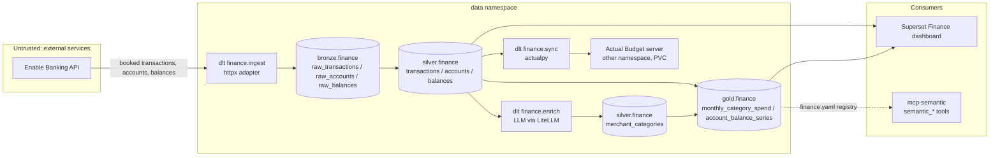

# Personal Finance Datalake — Design Spec

> **Fifth spec on disk, and the second analytical domain.** It extends none of
> the others; the four before it are
> [`001-bodega-spec.md`](001-bodega-spec.md),
> [`002-01-semantic-layer.md`](002-01-semantic-layer.md) with its phase
> [`002-02-semantic-layer-location.md`](002-02-semantic-layer-location.md),
> [`003-data-quality-and-lineage.md`](003-data-quality-and-lineage.md), and
> [`004-agents-hosted-model.md`](004-agents-hosted-model.md). It follows
> spec 001's pipeline shape (dlt -> dbt -> enrich -> gold) for a new domain, and
> inherits the semantic registry from spec 001 and the quality rules from
> spec 002 without modifying either.
>
> **Numbering:** filenames carry the file number, the prose carries the logical
> one. This is `005-` on disk and the fifth distinct topic.
>
> **Provider revised 2026-09-14: GoCardless -> Enable Banking.** The first draft
> was built on GoCardless Bank Account Data. A live test proved Enable Banking
> reaches the operator's accounts before any GoCardless onboarding had happened,
> so the provider half (row 1 below, §4.1, §4.2, §4.7 and the `WF-*` tasks) now
> names Enable Banking; GoCardless stays in the record as the deferred
> alternative rather than being deleted. The provider *interface* is unchanged —
> that is what made this a section rewrite and not a redesign.

---

## 0. Gate findings — read first

Fourteen checks were run before this spec was allowed a plan. Every finding was
read off a live system, pinned source, or upstream docs on 2026-09-13; the
provider rows were re-read against Enable Banking on 2026-09-14. Nothing was
inferred. Three findings changed the design (rows 6, 8, 12); one corrected an
intake assumption (row 8: Actual Budget needs no Postgres).

| # | Unknown | Finding | Source | Consequence |
|---|---------|---------|--------|-------------|
| 1 | Enable Banking API shape | Auth is a **self-signed RS256 JWT** per run — `iss=enablebanking.com`, `aud=api.enablebanking.com`, header `kid` = the application id — signed with the RSA key the browser generated at registration. Flow: `POST /auth` (aspsp name+country, `redirect_url`, `psu_type`, `access.valid_until`) -> browser consent -> `POST /sessions {code}` -> account `uid`s -> `GET /accounts/{uid}/transactions?date_from&date_to` and `/balances` | enablebanking.com/docs quick-start + API reference + live sandbox call 2026-09-14 | JWT minted **per run** (lives <=1 h, no refresh token ever persisted); only `status=BOOK` ingested — `PDNG` skipped (identity unstable, breaks idempotency). No `secret_id`/`secret_key` pair exists |
| 2 | History depth | No agreement object and no `max_historical_days`. `GET /transactions` accepts `strategy=longest` — "tries to find the longest possible period of transactions and fetches transactions for that period" — but "may use extra ASPSP calls"; daily calls use the default strategy and an explicit window. Date filters are honoured inconsistently (the sandbox doc notes some ASPSPs ignore them) | API reference + sandbox docs | Hardest available history is pulled once with `strategy=longest` on the backfill run; thereafter the DAG uses the configured window; the oldest `booking_date` seen per account is recorded as the observed cap. Per-bank cap is `[UNVERIFIED]` until WF-3 |
| 3 | Bank rate limits | PSD2 default as low as **4 calls/day/account per endpoint** for a PSU-not-present app; Enable Banking returns `429 ASPSP_RATE_LIMIT_EXCEEDED` ("Daily PSU not present consultation limit has been exceeded") with **no reset header**. Measured live 2026-09-14 against Openbank: `balances` answered 200 while the **first** `transactions` call was already 429 — the link/consent had consumed that endpoint's budget. Budget is **per endpoint, per account**, not per app | enablebanking.com docs + live Openbank call | Daily DAG = 1 transactions call/account; on 429 the fetch fails loudly and never retries in a loop. The effective Openbank limit may be **1/day**, not 4 — WF-3 measures it before the schedule is trusted |
| 4 | Consent expiry | No requisition: the session carries `access.valid_until` (EEA ~180 days; the live test returned `2027-03-12`). An expired or revoked session fails the data call | reference + live `POST /sessions` | Fetch surfaces it as `ACCESS_EXPIRED` naming the account/bank; re-link runbook in §4.2; `valid_until` is stored per account in `finance-enablebanking` so staleness is checkable before the run |
| 5 | Transaction id stability | Enable Banking exposes `entry_reference` — "unique and immutable ... can be used for matching transactions across multiple PSU authentication sessions" — and `transaction_id`, which the docs say "may change if the list of transactions is retrieved again" (**not** stable; `null` where detail-fetch is unsupported) | API reference `Transaction` schema; live sample | Bronze stable id = `entry_reference` when present, else a deterministic hash. `transaction_id` is **never** used as identity. Which banks supply `entry_reference` is `[UNVERIFIED]` until WF-3 — Openbank's live sample had it `null` on every row |
| 6 | Actual Budget API | **No REST API exists.** The official path is `@actual-app/api` (Node headless engine, CRDT sync); its `importTransactions` dedups on `imported_id` and runs the budget's rules | actualbudget.org/docs/api + api reference.md | A Python push needs `actualpy` or an HTTP-wrapper sidecar (row 7) |
| 7 | Python push mechanism | `actualpy` (PyPI; SQLAlchemy over a locally downloaded budget copy, `create_transaction(imported_id=...)`, `match_transaction`, `actual.commit()` syncs CRDT messages to the server) vs `jhonderson/actual-http-api` (Docker REST wrapper around the Node API, API-key auth) | pypi.org/project/actualpy, github.com/jhonderson/actual-http-api | **actualpy first** — no new service. `[UNVERIFIED]`: actualpy<->server version match and whether budget *rules* run on actualpy-inserted transactions; settled by the WF-8 probe, fallback = the sidecar |
| 8 | Actual server storage | SQLite files under `/data` (`server-files`, `user-files`); **no external Postgres** | actualbudget.org/docs/config | Corrects the intake assumption. One PVC, no CNPG database. Deployed from the `community-charts/actualbudget` chart (`persistence.enabled` defaults to **false** and must be flipped; image tag defaults to chart appVersion) |
| 9 | Airflow pipeline names | `VALID_PIPELINES = ("ingest", "export", "enrich")` hardcoded; `dlt_runner` itself discovers `<project>.<pipeline>` modules dynamically | `workflows/airflow/dags/utils/dlt.py:29`, `workflows/dlt/src/dlt_runner/__main__.py` | The app-push step named `sync` needs a one-line tuple extension + test in workflows/airflow; no runner change |
| 10 | Trino ACL | Access rules are catalog-anchored (`^(memory\|bronze\|silver\|gold\|test)$`) with schema `.*` for writers | `datahub-local-core/releases/data/values/trino.yaml.gotmpl:112-134` | A new `finance` schema inside the existing catalogs needs **zero** ACL change |
| 11 | Iceberg namespace creation | `create-schemas.sh` creates only `<catalog>.main`, yet `bodega` exists in bronze/silver/gold — dlt/dbt auto-create namespaces | script read + live `SHOW SCHEMAS` on the Trino coordinator | `finance` namespaces self-create; no Polaris job change |
| 12 | Semantic registry, multi-domain | The MCP server reads **one** `SEMANTIC_REGISTRY_PATH` (`/etc/mcp/semantic/registry.yaml`); the ConfigMap template globs every file under `config/semantic/*` into keys; scopes come from values (`silver.bodega,gold.bodega`) | `agents/sympozium/templates/mcpservers.yaml:146-153`, `mcp-configmaps.yaml` | `[UNVERIFIED]` whether mcp-semantic accepts multiple registries (no MCP checkout beside this repo). Settled by AI-1; fallbacks in §4.10 |
| 13 | dlt stack | dlt pinned **1.30.0**; `httpx` already a dependency; **`pyjwt` + `cryptography` are new** (RS256 signing) | `workflows/dlt/uv.lock:391`, `workflows/dlt/pyproject.toml` | The Enable Banking client is a plain httpx resource; new dependencies are `pyjwt`/`cryptography` for the JWT and `actualpy` for sync |
| 14 | Actual server version | Image `actualbudget/actual-server`; current line is 26.x; actualpy must be version-matched to the server | docker hub, npm `@actual-app/api@26.9.0` types | `[UNVERIFIED]` exact pin at deploy time — settled by INFRA-1 (pin the chart's image tag, pin the matching actualpy in `workflows/dlt/uv.lock`) |

**Rejected at the gate:** Actual Budget's *built-in* bank sync (GoCardless /
SimpleFIN) would make the fetch half of this spec unnecessary. Rejected: it
bypasses the lakehouse (no bronze history, no dbt models, no semantic metrics),
and it would run a second independent fetcher against the same per-account
4-calls/day PSD2 budget — two consumers of one legal rate limit, neither
knowing about the other. The lake stays the single fetcher; Actual Budget
receives data only through §4.6.

**Target banks (user-stated):** CaixaBank, BBVA, ING, Openbank, Santander —
all Spanish. ASPSP names (`GET /aspsps?country=ES`) and per-bank history caps
are read live at onboarding, never hardcoded from memory. Openbank was linked
first, on 2026-09-14.

---

## 1. Context

### 1.1 Where the platform is today

`bodega` is the first real analytical domain and it is complete end to end:
n8n drains parsed Mercadona invoices into Kafka, dlt lands
`bronze.bodega.raw_invoices` in Iceberg over Apache Polaris, four silver and
six gold dbt models transform it, an LLM enrich step categorises product
descriptions against a 27-line `categories.csv`, `bodega_daily` orchestrates
the chain, and consumers read it through eleven Superset datasets, 25 charts
and a semantic registry of 3 semantic models and 8 metrics served by
`mcp-semantic`.

`finance` is the second domain, and it differs from bodega in its source
class. Bodega's source needed browser automation, which is why n8n and Kafka
sit in front of it. Bank data arrives through Enable Banking — a plain REST
API with a per-run RS256 JWT — so there is no n8n, no Kafka topic and no
scraping: dlt calls the API directly. What stays identical is everything
downstream: the Iceberg medallion, the dbt project layout, the enrich pattern,
the Airflow task helpers, the Superset bundle mechanism and the semantic
registry format.

### 1.2 The problem

Personal bank transactions currently exist only inside the banks' own apps.
There is no history under the operator's control (PSD2 caps what an API call
returns, and UIs truncate long before that), no cross-bank view, no analytics
surface, and the budgeting tool the operator wants to use (Actual Budget) is
not deployed and would, on its own, duplicate fetching against a legally
rate-limited API.

The cost ordering:

1. **No durable history.** Every day without ingestion is a day the bank's
   history window can no longer reach. This is the only irrecoverable cost.
2. **No single fetcher.** If Actual Budget's built-in sync and a pipeline both
   pull from the bank, they compete for the same per-account daily budget and
   can lock each other out (429).
3. **No cross-bank analytics.** Five banks' spending cannot be compared
   without a shared silver layer.
4. **Manual budgeting.** Without the app sync, every transaction is retyped
   into Actual Budget by hand.

### 1.3 Why the pieces ship together

The fetch half without the sync half leaves data visible only to dbt and
Superset — not in the app the operator actually budgets in. The sync half
without the lake means Actual Budget's built-in bank sync is the only
copy: capped history, no lineage, no metrics. The analytics surfaces
(Superset, semantic registry) are what make the lake more than a cold backup.
One DAG, one merge, one domain.

### 1.4 Where this must not create a second source of truth

- **The lake owns ingested bank data.** Bronze is the raw provider payload;
  silver/gold are the only curated reads. The Actual Budget transactions
  (§4.6) are a *derived, replaceable* copy — deleting them and re-running
  the sync must reproduce them exactly.
  Nothing reads them back into the lake (non-goal: no bidirectional sync).
- **Actual Budget owns budgeting state.** Budgets, category assignments,
  payee renames and manual transactions inside the app are never harvested
  into the lake. The LLM categorisation in `silver.finance` is a *lake-side
  analytics dimension*, not a write into the app's category tree (§4.6 pushes
  transactions without categories — the app's own rules decide).
- **The provider adapter owns wire-format knowledge.** PSD2-via-Enable-Banking
  quirks (string amounts, `remittance_information` as a list, per-bank missing
  fields, `transaction_id` sometimes null) are normalised once, in the
  adapter, before bronze. No dbt model parses provider JSON.

---

## 2. Goals

| # | Goal | Acceptance signal |
|---|------|-------------------|
| 1 | Fetch transactions from the Spanish banks via a provider adapter | `python -m dlt_runner --pipeline ingest --project finance --target homelab` lands every booked transaction for all linked accounts in `bronze.finance.raw_transactions`; two consecutive runs over the same window produce no new rows (stable-id idempotency) |
| 2 | Max-history backfill on first link | The first ingest reads the bank's full returned history (no cap is requestable), records the oldest `booking_date` seen per account as the observed cap, and returns rows older than 90 days for at least one bank whose history allows it |
| 3 | Medallion transforms | `dbt build --project finance` produces silver (`transactions`, `accounts`, `balances`) and gold (monthly category spend, per-account balance series) with tests green on both `local` and `homelab` targets; every `schema.yml` column description is non-blank (the documentation gate depends on it) |
| 4 | LLM categorisation | `--pipeline enrich` categorises unseen (merchant, bank) pairs into `silver.finance.merchant_categories`; already-categorised pairs are never re-queried; parse failures land as `PARSE_ERROR` rows, never dropped silently |
| 5 | Actual Budget receives every transaction exactly once | After two consecutive `--pipeline sync` runs, the app's transaction count for the window is unchanged by the second run (`imported_id` dedup), verified by a probe count before and after |
| 6 | Access expiry is actionable, not silent | A run against an expired or revoked session fails with `ACCESS_EXPIRED` naming the account and the re-link runbook; it never reports success with zero rows |
| 7 | Analytics surfaces live | The Superset `Finance` dashboard imports from the built bundle; `workflows/dbt/semantic/finance.yaml` passes `compile.py` and its metrics answer through the `semantic_*` MCP tools with the finance scopes added |
| 8 | Actual Budget deployed by core | The `actualbudget` release from the `community-charts/actualbudget` chart is healthy in the `other` namespace with `persistence.enabled: true`, version pinned in `values/_version.yaml` and matching the actualpy pin in `workflows/dlt/uv.lock`; reachable at the standard ingress with password login |

### Non-goals

- **No bidirectional sync.** Budgets, edited categories and manual
  transactions inside Actual Budget never flow back to the lake. The lake
  owns ingestion; the app owns budgeting. The line comes from §1.4 — reading
  app state back would make Actual Budget a second source of truth for
  categorisation.
- **No pending transactions.** Only `booked` entries are ingested (`status=BOOK`
  in the Enable Banking payload). Pending entries (`PDNG`) change identity when
  they book, which breaks the stable-id idempotency goal 1 depends on.
- **No second provider implemented.** The adapter interface ships with Enable
  Banking only. A GoCardless, Salt Edge or Plaid adapter is built when a bank
  appears Enable Banking cannot reach — not before, because an untested second
  implementation of an interface is just a guess about the interface. (The
  first draft of this spec picked GoCardless for that slot; the interface is
  unchanged by the swap — §0.)
- **No n8n involvement.** Unlike bodega there is no browser automation, so
  nothing publishes to Kafka and no workflow export changes.
- **No agent access to raw transaction rows.** Bank transactions are personal
  data. Personas reach finance numbers only through semantic-layer metrics;
  no persona is given a Trino tool scoped to `silver.finance` rows (§4.7).
- **No balance reconciliation.** Balances are stored as fetched and served as
  a series; they are never audited against statements or against the
  transaction sum. A drift finding is a future quality rule (spec 002's
  domain), not this pipeline's job.

---

## 3. Architecture



Trust boundary: everything left of the cluster frame. The Enable Banking
payload is untrusted input — the adapter (§4.1) is the only code that touches
wire format, and it normalises before bronze. The Actual Budget server is
trusted storage but a **single-writer** resource: only `finance.sync` writes to
it, and its built-in bank sync is never configured (§5, ordering mistake).

| Layer | Component | Owns | Must not |
|-------|-----------|------|----------|
| Provider adapter | `projects/finance/providers/enablebanking.py` | JWT minting, session/account reads, PSD2 normalisation, error classification (429 / `ACCESS_EXPIRED` / JWT/redirect errors) | Know anything about medallion layers; retry against a rate limit |
| Ingest | `dlt finance.ingest` | Landing raw + normalised rows in `bronze.finance`, stable-id computation, window scoping | Parse payloads beyond the adapter's output; write outside bronze |
| Transform | `dbt finance` (silver/gold) | Typing, dedup, payee derivation, IBAN masking, aggregations, column docs | Read bronze from any consumer-facing model output; leave a blank description |
| Enrich | `dlt finance.enrich` | LLM categorisation of unseen payees into `silver.finance.merchant_categories` | Re-query categorised pairs; drop parse failures silently |
| App sync | `dlt finance.sync` (actualpy) | Idempotent push into Actual Budget via `imported_id` | Push categories; harvest app state back; run while another writer holds the budget |
| Orchestration | `finance_daily` DAG | Task order, secrets wiring, window params | Contain business logic |
| App hosting | core `actualbudget` release | Server lifecycle, PVC, ingress, login | Serve as a data source for the lake |

---

## 4. Design

### 4.1 Provider adapter interface

A provider is a Python class satisfying a narrow protocol, instantiated from
env by the ingest pipeline:

```python
class BankDataProvider(Protocol):
    def list_accounts(self) -> list[Account]: ...
    def fetch_transactions(self, account_id: str, date_from: date, date_to: date) -> list[Transaction]: ...
    def fetch_balances(self, account_id: str) -> list[Balance]: ...
```

`Account`, `Transaction` and `Balance` are adapter-normalised dataclasses —
typed amounts (`Decimal`), ISO dates, flat counterparty fields, plus
`payload_json` carrying the untouched provider object. The Enable Banking
implementation owns:

- **Auth**: an RS256 JWT minted per run from the application id (`kid`) and the
  RSA private key — `iss=enablebanking.com`, `aud=api.enablebanking.com`,
  `iat`/`exp` (<=1 h). No token is persisted or refreshed: the DAG runs daily
  and re-minting is cheaper than the secret-write RBAC a stored token needs.
- **Session/account reads**: accounts come from the operator-linked session,
  not an accounts endpoint — `POST /auth` -> browser consent -> `POST
  /sessions {code}` returns the authorised accounts with their `uid`,
  `account_id.iban`, currency and owner name. Onboarding records each account's
  alias, `iban` and session-scoped `uid`; the pipeline addresses the API by
  `uid` and uses the alias as the stable identity, so a re-link only rewrites
  `uid` and never re-keys bronze. `list_accounts()` reads
  `/accounts/{uid}/details` per account for currency and holder name (one call
  per account on the details endpoint, which has its own budget).
- **Window**: `GET /accounts/{uid}/transactions?date_from&date_to`, following
  `continuation_key` until it stops (batches are provider-sized and ordered
  newest-first; the sandbox doc warns size and order vary per ASPSP). The
  first (backfill) run passes `strategy=longest`, which asks the ASPSP for the
  longest period it can return — this is the max-history mechanism in place of
  GoCardless's `max_historical_days` (gate 2). It "may use extra ASPSP calls",
  so daily runs use the default strategy and the explicit window.
- **Error classification**: `429 ASPSP_RATE_LIMIT_EXCEEDED` fails the run
  quoting the daily PSU-not-present limit (gate 3 — no reset header, so the
  message plus the account is all there is); an expired or revoked session
  fails as `ACCESS_EXPIRED` naming the account (gate 4, goal 6); a rejected
  JWT or an unwhitelisted `redirect_url` (401 / `REDIRECT_URI_NOT_ALLOWED`)
  fails naming the credential to fix.

*Alternative rejected:* dlt's built-in `rest_api` source. It handles
pagination and auth declaratively, but the per-account fan-out, the
three-call shape (auth/session, transactions, balances) and — decisively — the
need to classify PSD2 error codes into pipeline-level failures with runbook
text make a plain httpx client (already a dependency, gate 13) the smaller
total surface. The interface, not dlt's source machinery, is what makes a
second provider possible later.

What each of the five banks supplies is unknown until WF-3 (gate 5); the
stable-id rule below does not depend on the answer. Known so far: Openbank's
live sample had **both** `entry_reference` and `transaction_id` null on every
row, so its identity is hash-only.

**Stable id.** `stable_id = entry_reference` when the ASPSP supplies a non-null
one (the docs call it unique and immutable across sessions), else
`sha256(account_id | booking_date | amount | currency | remittance |
counterparty)` truncated to 32 hex chars. `transaction_id` is deliberately
**not** an input: Enable Banking documents that it may change when the same
list is re-fetched. `remittance` normalises Enable Banking's
`remittance_information` (a list) by joining on a single space; `counterparty`
is the creditor/debtor `name` when present. Computed in the adapter, stored in
bronze, and reused as Actual Budget's `imported_id` (§4.6) — one identity
across the whole pipeline. A hash collision across *different* transactions at
the same bank on the same day for the same amount and text is accepted: PSD2
gives nothing better, and bodega's `invoice_number` key has the same "trust
the source's identity" shape.

### 4.2 Onboarding and consent model

Linking a bank is inherently manual (browser consent) and happens once per
consent window per account (gate 4). Three steps, the first two in a browser:

1. Register a **production** application in the Enable Banking Control Panel:
   name, redirect URL(s), description, data-protection email, privacy and terms
   URLs. Choose *Generate in the browser* for the key; the browser downloads
   `<app-id>.pem` (the app id is also the JWT `kid`). The app starts
   **Inactive**.
2. **Activate by linking accounts** — accept Enable Banking's terms, complete
   the bank's consent flow. The app becomes Active in restricted mode; only
   linked accounts are readable. This activates the *app*, not an API session.
3. `uv run python -m finance.onboard` (operator laptop, never in-cluster)
   drives the API half: mint a JWT, `GET /aspsps?country=ES` to resolve the
   exact ASPSP name, `POST /auth` for the chosen bank, print the consent URL,
   exchange the returned `code` for a session (`POST /sessions`), then print
   each account's alias, masked IBAN, `uid` and the session `valid_until`. The
   operator pastes the printed values into `finance-enablebanking`.

Rules that fall out of the flow:

- The consent URL is opened in a browser and cannot be automated, so onboarding
  is never in a DAG; the daily pipeline only ever reuses a live session.
- Linking and API authorisation are two different grants (steps 2 and 3). An
  account can be linked and still have no session; the adapter fails naming the
  credential to fix rather than reporting zero rows.
- No `app_id`, private key, IBAN, account uid or session is committed to git
  beyond the operator-managed `finance-enablebanking` secret.

The secret `finance-enablebanking` holds the shared RSA `private_key` and
`accounts.json` — `{alias: {iban, uid, app_id, valid_until, institution_id}}`.
`valid_until` is per account so the pipeline can name an expired consent before
the data call, not after; `uid` is rewritten on every re-link (Enable Banking
scopes it to the session and it is only valid while that session is
authorized), which is exactly why the alias, not the uid, is the pipeline
identity.

*Alternative rejected:* an interactive OAuth helper that writes the session
into the lake. A session is a credential; it belongs in the k8s secret, pasted
by the operator, exactly as bodega's onboarding pastes into its secret.

*GoCardless, for the record:* it would have been
`secret_id`/`secret_key` -> `POST /token/new` -> agreement -> requisition ->
`?date_from&date_to`. The provider-neutral reasoning that survives the swap is
the one that rejected persisting a refresh token: minting a short-lived
credential per run beats storing one, whatever the wire format.

### 4.3 Bronze schema

Three tables in `bronze.finance`, dlt `merge` disposition except balances:

- `raw_transactions` — PK `(provider, account_id, stable_id)`. Columns:
  `booking_date`, `value_date`, `amount` (decimal), `currency`,
  `remittance_info`, `creditor_name`, `debtor_name`, `creditor_iban`,
  `debtor_iban`, `bank_transaction_code`, `provider`, `institution_id`,
  `payload_json`, `_ingested_at`.
- `raw_accounts` — PK `(provider, account_id)`: `institution_id`,
  `iban`, `currency`, `owner_name`, `status`, `payload_json`, `_ingested_at`.
- `raw_balances` — **append**: one snapshot per fetch per balance type:
  `account_id`, `balance_type`, `amount`, `currency`, `reference_date`,
  `_ingested_at`. Append because a balance is a fact-at-a-time; the series
  is the point (goal 3's gold model).

Enable Banking specifics the adapter flattens **before** bronze: `status` is
filtered to `BOOK` (only booked rows land, §2); `remittance_information` (a
list) becomes `remittance_info`; `credit_debit_indicator` is folded into the
sign of `amount`; `provider` is the literal `enablebanking`; and
`institution_id` is the ASPSP name carried by the account's alias in
`finance-enablebanking` (the payload itself names no bank). `reference_date` is
often `null` on balances, so `raw_balances` falls back to the date of
`_ingested_at` for the series key.

Ingest window: `FINANCE_FROM_DATE` / `FINANCE_TO_DATE` env (DAG params,
default 14-day lookback — longer than bodega's 7 because banks post
settlements late), always re-fetched and merged, so overlaps are free.
Unlike bodega there is **no stale-row deletion**: bank transactions are
immutable once booked, and a provider-side correction arrives as a new
booking, not a deletion. A transaction that vanishes from the API stays in
bronze — the lake is the longer memory (that is goal 2's entire point).

Bronze keeps full IBANs and owner names (raw fidelity, loader territory).
Nothing user-facing reads bronze, so masking happens once, in silver (§4.4).

### 4.4 dbt silver/gold models

`workflows/dbt/projects/finance/`, structurally a copy of bodega's project
(profile with `local` DuckDB / `homelab` Trino targets, `+database` per
layer, `generate_schema_name` verbatim, `persist_docs` on relations and
columns).

Silver (full-rebuild `table` materialisations — personal-finance volume is
tens of thousands of rows, incremental machinery would be cost without
benefit):

- `transactions` — one row per booked transaction: typed dates/decimals,
  `direction` (inflow/outflow from sign), `payee` (creditor name, falling
  back to debtor name, falling back to remittance), `payee_clean`
  (upper/trim/collapse-whitespace — the enrich join key), `iban_masked`
  (`****` + last 4), `institution_id`, `stable_id`, `account_id`.
- `accounts` — one row per account: masked IBAN, institution, currency,
  status from the latest `raw_accounts` snapshot.
- `balances` — one row per account per `reference_date`, latest snapshot
  wins (row_number over `_ingested_at`).

Gold:

- `monthly_category_spend` — transactions x `merchant_categories` joined on
  `payee_clean`, grouped by month x category, inflow/outflow separated.
  Uncategorised payees keep an `UNCATEGORISED` sentinel row rather than
  vanishing from the total — absence is expressible.
- `account_balance_series` — balances joined to accounts, one row per
  account per day with the masked IBAN and institution for labelling.

Every column in `schema.yml` carries a non-blank description, and the
bodega-style test that fails the build on a blank one is copied — the
semantic server's documentation gate reads Iceberg column comments and a
blank description is indistinguishable from undocumented (CLAUDE.md,
"persist_docs is load-bearing").

### 4.5 LLM enrich

`dlt finance.enrich`, the bodega enrich pattern exactly: read distinct
`payee_clean` values from `silver.finance.transactions` not yet in
`silver.finance.merchant_categories` (excluding `PARSE_ERROR` rows), batch
30 per LiteLLM call, merge on PK `payee_clean`.

- Keyed on `payee_clean` alone, **not** `(payee_clean, institution)` — the
  same merchant must not be categorised twice because two banks spell it
  differently normalised; the first institution seen is stored as
  `first_seen_institution` for debugging only.
- A new `projects/finance/categories.csv` (~25 rows: GROCERIES,
  DINING_OUT, TRANSPORT, UTILITIES, HOUSING, HEALTH, INSURANCE, INCOME,
  INTERNAL_TRANSFER, FEES_INTEREST, TAXES, SHOPPING, ENTERTAINMENT, TRAVEL,
  EDUCATION, CASH, SUBSCRIPTIONS, SAVINGS_INVESTMENT, OTHER...) with
  descriptions and examples, same three-column shape as bodega's.
- Prompt follows the AI prompt policy: short, literal, JSON-only output,
  built from the CSV at call time (the bodega `SYSTEM_PROMPT_TEMPLATE`
  shape). Payee text is Spanish -> `FINANCE_PAYEE_LANGUAGE`, default
  `Spanish`.
- Failures land as `category=OTHER, subcategory=PARSE_ERROR` and are
  re-queried next run (the exclusion above) — never dropped, never
  silently frozen.

*Alternative rejected:* pushing lake categories into Actual Budget
transactions. Rejected at intake (one-way, app owns categories): writing
`category` from the lake would fight the app's own rules on every sync and
make two systems co-owners of one field.

### 4.6 Actual Budget sync (actualpy)

`dlt finance.sync` — the reason `VALID_PIPELINES` grows by one (gate 9).
New dependency: `actualpy`, pinned in `uv.lock`, version-matched to the
server image pin (gate 14, INFRA-1).

Flow per run:

1. Read `silver.finance.transactions` for the sync window
   (`FINANCE_SYNC_WINDOW_DAYS`, default 60 — late-posted corrections arrive
   within days, and the first run pushes full history via
   `FINANCE_FROM_DATE`-style override).
2. `Actual(base_url, password, file=<sync id>)` — download the budget,
   query the transactions already carrying each `imported_id`, build the
   skip set. **This check is the pipeline's, not the library's**: actualpy's
   `create_transaction` does not reconcile like Node's `importTransactions`
   (gate 7), so dedup is explicit: `imported_id = "enablebanking:" + stable_id`
   and a pre-query of existing `financial_id`s in the window.
3. For each remaining row: `create_transaction(session, date=booking_date,
   account=<mapped Actual account>, payee=None, imported_payee=payee,
   amount=signed decimal, imported_id=..., notes=remittance truncated)`.
   Accounts must pre-exist in the budget (created once, by hand, in the
   UI); the map bank `account_id` -> Actual account name lives in the
   `finance-actual` secret/configmap. A row whose account is unmapped fails
   the run naming the account — never silently skipped.
4. `actual.commit()` once at the end. `FINANCE_SYNC_DRY_RUN=true` (and the
   `local` target by default) stops before commit and logs the counts that
   would be added.

No `category` is ever set (§4.5). Whether the budget's *rules* run over
synced transactions on the server is `[UNVERIFIED]` (gate 7) — WF-8 probes
it with a throwaway budget; if rules do not apply, transactions arrive with
payee text and the user's rules categorise on next app open or not at all —
acceptable per the non-goal, but recorded. If actualpy proves unable to
talk to the pinned server version at all, the fallback is the
`jhonderson/actual-http-api` sidecar in the core release (gate 7), and the
sync pipeline swaps transport only — the read/dedup/map logic is unchanged.

Single writer: the DAG places `sync` last and nothing else writes; Actual's
own built-in bank sync is never configured (§5).

### 4.7 Secrets and data privacy

Secrets (k8s, `data` namespace, wired via the existing `SecretEnvVarRef`
pattern): `finance-enablebanking` (RSA `private_key` + `accounts.json` =
alias -> `{iban, app_id, valid_until}`) and `finance-actual` (server password,
sync id, account map). The Enable Banking material is already written into
`datahub-local-secrets`; nothing else is committed to git, and the onboarding
CLI prints the rest for the operator to paste.

Bank transactions are personal data, so the lake's normal openness is
deliberately narrowed:

- Superset datasets and the semantic registry read `silver`/`gold` only —
  full IBANs and owner names stop at bronze, and silver masks IBANs.
- The semantic registry exposes **aggregate metrics only** (spend by
  category/month, balance series) — no metric or dimension whose value is a
  counterparty name, so a persona can answer "how much went out on
  utilities" and cannot enumerate "every payment to X".
- No persona is granted a Trino query tool scoped to `silver.finance`
  rows; the `mcp` Trino user is read-only and the scopes added in AI-1 are
  `silver.finance,gold.finance` for the *semantic server's* discovery only.

### 4.8 Airflow DAG

`finance_daily` in `workflows/airflow/dags/`, bodega's DAG shape:

```
dlt_ingest_finance >> dbt_silver_finance >> dlt_enrich_finance
    >> dbt_gold_finance >> dlt_sync_actual
```

Schedule `0 6 * * *` UTC (bodega runs 08:00 — staggered; the PSD2 budget is
per account per endpoint so there is no contention, the stagger is for cluster
load). Params `from_date`/`to_date` default to a 14-day lookback (§4.3). Secret
wiring per task: ingest needs ICEBERG + enablebanking; enrich needs ICEBERG +
LITELLM; sync needs finance-actual. `retries: 1` like every DAG
here; a 429-classified failure retries once and then surfaces through the
same Airflow failure path bodega uses — no new alerting mechanism is
invented by this spec.

`dbt_silver_finance` / `dbt_gold_finance` reuse `create_dbt_task` with
`--project finance --select silver.*` / `gold.*`; the dbt image already
copies every project directory, so no image change (verified:
`workflows/dbt/Dockerfile`).

### 4.9 Actual Budget deployment (datahub-local-core)

New release in `releases/other/helmfile.yaml.gotmpl` using the
`community-charts/actualbudget` chart (user-chosen), pinned in
`values/_version.yaml` like core's other third-party charts. Values:
`persistence.enabled: true` (the chart defaults it to **false** — a silent
data-loss default, gate 8), `persistence.size: 10Gi`, Longhorn storage
class, `image.tag` pinned to a specific server version matching the
actualpy pin, `login.method: password` with the password from a core-managed
secret, ingress per the namespace's existing pattern with TLS (browsers
need a secure context for the sync UI). Resources modest (single-user
Node server). `replicaCount: 1` — CRDT sync assumes one server instance.

### 4.10 Semantic registry and Superset

`workflows/dbt/semantic/finance.yaml` in the bodega registry format
(MetricFlow-compatible `semantic_models`/`metrics`, `ref()` to dbt models).
Seed: one semantic model over `monthly_category_spend` (dimensions: month,
category, institution, direction; measures: spend, inflow) and one over
`account_balance_series` (balance as latest/avg). `compile.py` gates it as
it gates bodega — which imports `registry.py` from a datahub-local-ai-mcp
checkout (`MCP_REPO`); the gate task therefore requires that checkout
beside this repo (absent today — noted in §6).

The open structural question is gate 12: the semantic server reads one
`SEMANTIC_REGISTRY_PATH`. AI-1 checks the MCP repo for multi-registry
support. Fallback if absent, in order of preference: (a) a **second
MCPServer entry** `semantic-finance` in `agents/sympozium` with its own
config dir (`config/semantic_finance/registry.yaml` -> symlink to
`finance.yaml`) and scopes `silver.finance,gold.finance` — zero server
change, the existing template glob and symlink mechanism already support
it; (b) an MCP-server change to accept a registry list. A merged single
file is rejected: it would be a second copy drifting from the per-domain
registries beside their dbt projects.

Superset: `workflows/superset/projects/finance/dashboard_export/` with
datasets over `silver.finance.transactions`, `gold.finance.*` (never
bronze), charts (monthly category spend, balance series, top payees,
inflow/outflow), one dashboard, fresh stable `uuid`s; then
`python3 workflows/superset/scripts/build_bundles.py` and the release's
helmfile apply, exactly the bodega mechanism.

---

## 5. Implementation plan

Task ids: `WF-*` = this repo (`workflows/*`), `INFRA-*` = datahub-local-core,
`AI-*` = `agents/sympozium` (+ its MCP wiring).

### Phase A — hosting (core)

- [ ] **INFRA-1** Add the `actualbudget` release: chart pinned in
      `values/_version.yaml`, `persistence.enabled: true` (10Gi, Longhorn),
      image tag pinned, password login from a core secret, TLS ingress.
      Record the chosen server version for the actualpy pin.

**Done when:** goal 8's signal holds: the release is healthy, the PVC is
bound, and the UI answers over TLS at the ingress with password login.

### Phase B — fetch

- [x] **WF-1** `workflows/dlt/projects/finance/`: package skeleton,
      `config.py` (re-exporting `dlt_runner.config`, `FINANCE_*` env
      helpers), the `BankDataProvider` protocol, the Enable Banking adapter
      (RS256 JWT minting, ASPSP resolution, session/account read, transactions
      with `continuation_key` pagination, balances, error classification incl.
      `ACCESS_EXPIRED` and 429), stable-id rule. New deps `pyjwt` +
      `cryptography`. Unit tests against **synthetic** JSON fixtures (no live
      API in CI, and no real account data in the repo).
- [ ] **WF-2** `finance.onboard` CLI + the re-link runbook in
      `workflows/dlt/README.md`. *Blocked by WF-1.*
- [ ] **WF-3** Live onboarding: operator links the bank, runs the CLI,
      records each target bank's observed history cap and `transaction_id`
      presence (closes gates 2/5 `[UNVERIFIED]`), and writes/updates
      `finance-enablebanking` in `datahub-local-secrets`. *Blocked by WF-2;
      needs operator + real bank access.*
- [ ] **WF-4** `ingest.py` pipeline: three bronze resources, merge/append
      dispositions, window env, `local` + `homelab` targets. Tests: local
      DuckDB end-to-end from fixtures; homelab verified by WF-3's real run.
      *Blocked by WF-1.*
- [ ] **WF-5** Airflow: extend `VALID_PIPELINES` with `"sync"` (+ test),
      `finance_daily` DAG with the ingest task wired and secrets.
      *Blocked by WF-4.*

**Done when:** goals 1, 2 and 6 hold against the first live bank — two
consecutive runs add nothing, backfill depth matches the recorded cap, and a
deliberately expired session fails as `ACCESS_EXPIRED`.

### Phase C — transform

- [ ] **WF-6** `workflows/dbt/projects/finance/`: silver (`transactions`,
      `accounts`, `balances`), gold (`monthly_category_spend`,
      `account_balance_series`), `schema.yml` with every description
      non-blank, the blank-description test copied from bodega,
      `dbt parse` green on both targets + integration test on DuckDB.
      *Blocked by WF-4 (bronze shape).*
- [ ] **WF-7** `enrich.py` + `categories.csv` + prompt template; local
      tests with a stubbed `call_llm`; wire `dbt_silver`, `dlt_enrich`,
      `dbt_gold` into the DAG. *Blocked by WF-6.*

**Done when:** goal 3 and goal 4 signals hold on both targets.

### Phase D — consumers

- [ ] **WF-8** `sync.py` with actualpy: window read, `imported_id`
      pre-query dedup, account map with fail-on-unmapped, dry-run mode,
      `local` = dry-run by default. Probe against a throwaway budget on the
      deployed server: does the pinned actualpy talk to the pinned server,
      and do budget rules apply to synced transactions? (closes gate 7
      `[UNVERIFIED]`; fallback = http-api sidecar, transport-only swap).
      *Blocked by INFRA-1, WF-6.*
- [ ] **WF-9** Complete the DAG (`dlt_sync_actual`)
      and run the full chain on `homelab`. *Blocked by WF-7, WF-8.*
- [ ] **WF-10** Superset bundle: `projects/finance/dashboard_export/`
      (datasets on silver/gold only), `build_bundles.py`, helmfile apply.
      *Blocked by WF-6.*
- [ ] **AI-1** `workflows/dbt/semantic/finance.yaml` + compile gate green;
      resolve gate 12 (multi-registry support, else the second-MCPServer
      fallback); add the finance scopes; verify per-server tool counts in
      `mcp-discover` logs after sync. *Blocked by WF-6; needs a
      datahub-local-ai-mcp checkout for `compile.py`.*

**Done when:** goal 5 and goal 7 signals hold, and one scheduled
`finance_daily` run has gone green end to end with the transactions visible
in Superset and exactly once in Actual Budget.

### Cross-repo sequencing

| Order | Repo | Tasks | Gate it closes |
|-------|------|-------|----------------|
| 1 | datahub-local-core | INFRA-1 | 8, 14 |
| 2 | this repo (dlt) | WF-1..WF-4 | 1-5, 13 |
| 3 | this repo (airflow) | WF-5 | 9 |
| 4 | this repo (dbt/dlt) | WF-6, WF-7 | — |
| 5 | this repo | WF-8 | 7 |
| 6 | this repo (superset/sympozium) | WF-9, WF-10, AI-1 | 12 |

**The ordering mistake most likely to waste a weekend:** configuring Actual
Budget's *built-in* bank sync "just to see it work" before or while WF-8 lands.
Two fetchers then share one legal 4-calls/day/account budget (gate 3): the
pipeline starts failing 429s on days the app already fetched, the failures look
like a provider outage, and every transaction arrives twice under two different
identities — the app's own `imported_id` scheme and the pipeline's — so goal 5's
dedup cannot see the duplicates. The app's bank sync stays unconfigured,
permanently, and that decision is recorded here rather than rediscovered.
Runner-up: letting the server image float on `latest` while actualpy is pinned —
a server-side sync-protocol change then corrupts budget files on commit (gate 14
exists for this).

---

## 6. Risks, open questions, definition of done

### Risks

| Risk | Mitigation |
|------|------------|
| A Spanish bank's PSD2 connection is flaky or drops consent early (institution-side, outside Enable Banking's control) | Error classification keeps the failure named (`ACCESS_EXPIRED` vs 429 vs a generic PSD2 error); the 14-day overlap window means a few lost days are recovered by the next green run; bronze is append-only memory, so nothing already landed can be lost |
| A bank omits `transaction_id` **and** rewrites the fields the hash is built from (remittance text is bank-formatted) — the same transaction lands twice under two stable ids | Openbank already omits it (gate 5). WF-3 does not just record the other banks' `transaction_id` presence: it fetches the same window twice a day apart and diffs, choosing hash inputs from fields observed to be stable for that bank before the first real ingest |
| The bank's history cap is smaller than hoped, or `date_from`/`date_to` is ignored, so the daily window returns everything every run | Bronze merge on stable id makes re-fetching free (idempotent), and goal 2 records the observed cap instead of assuming one; a bank that ignores filtering only costs response size, not correctness |
| actualpy drifts from the pinned server version; a protocol change corrupts the budget file on commit | Both pins recorded side by side (gate 14): chart `image.tag` in core, `actualpy` in `uv.lock`; WF-8 probes a throwaway budget first; fallback transport (http-api sidecar) swaps without touching sync logic |
| A second writer touches the budget while sync runs (user in the UI is fine — CRDT handles concurrent clients — but Actual's built-in bank sync would not be) | Single-writer rule (§4.6): built-in bank sync is never configured; the ordering mistake in §5 is the permanent record of why |
| The LLM miscategorises a payee and the mistake is frozen (enrich never re-queries categorised rows) | `PARSE_ERROR` rows are re-queried by design; human corrections are a `merchant_categories` row update — same operational story as bodega's products table, including its known limitation |
| Enable Banking changes access terms or a restricted application stops working | Personal, single-account scale is well inside the restricted mode's terms; the adapter interface (§4.1) is the escape hatch — a provider change is an adapter, not a rewrite |
| The consent expires and is forgotten until the DAG fails | Failing loudly *is* the design (goal 6): the run names the account and the runbook, and `valid_until` in `finance-enablebanking` lets a pre-flight check catch staleness before the data call; a silent zero-row success is the failure mode this spec forbids |
| Personal data reaches an agent or a dashboard | §4.7: silver masks IBANs, consumers read silver/gold only, semantic metrics are aggregates with no counterparty dimension, no persona gets row-level Trino access to `silver.finance` |
| The budget PVC is the only copy of the SQLite budget files | INFRA-1 must state how `/data` is backed up under core's existing regime for PVC apps; an unbacked single-PVC app is how budget history dies quietly |

### Open questions

| Question | Settle by |
|----------|-----------|
| Each bank's observed history cap and `transaction_id` presence for CaixaBank, BBVA, ING, Openbank, Santander (gate 2/5 `[UNVERIFIED]`; Openbank known: no `transaction_id`) | WF-3: inspect the first real ingest per bank and record the values in the onboarding runbook |
| Is Openbank's unattended `transactions` limit really 1/day, or was the live 429 a one-off from the linking run? (gate 3) | WF-3: repeat the fetch on a fresh day and count before/after; if it is 1/day the daily DAG is still inside it, but the number must be recorded |
| Does the pinned actualpy speak to the pinned server, and do budget rules run over synced transactions (gate 7 `[UNVERIFIED]`)? | WF-8 probe against a throwaway budget on the deployed server |
| Does mcp-semantic accept more than one registry file, or does finance need the second-MCPServer fallback (gate 12 `[UNVERIFIED]`)? | AI-1, with a datahub-local-ai-mcp checkout beside this repo (`compile.py` imports from it) |
| Exact Actual server version to pin (gate 14 `[UNVERIFIED]`) | INFRA-1: pin the chart's `image.tag`, then pin the matching actualpy in the same PR series |
| One Actual account per bank account, or one per bank? (the account map in §4.6 depends on it) | Operator, in the budget-setup step before the first WF-8 sync — recorded in the `finance-actual` configmap |
| The finance `categories.csv` taxonomy — is the seeded ~25-category list the operator's? | WF-7: seed it, run enrich once, review the distribution; the CSV is operator-owned afterwards, exactly like bodega's |
| Whether gold grows beyond the two models (e.g. payee-level spend, fee tracking) | After the first month of real data; a follow-up phase of this spec, not a silent model addition |
| How `/data` of the actualbudget release is backed up | INFRA-1, per core's existing backup regime for PVC-backed apps |

### Definition of done

Goals 1-8 all hold, evidenced by:

1. One scheduled `finance_daily` run goes green end to end on `homelab`
   (goals 1, 3, 4 — ingest, silver, enrich, gold all report row counts).
2. The first linked bank's history extends back to the observed cap WF-3
   recorded for it (goal 2).
3. A deliberately expired or revoked session fails the ingest with
   `ACCESS_EXPIRED` naming the account (goal 6).
4. The Superset `Finance` dashboard renders from the imported bundle and
   `semantic_*` answers a finance metric with the new scopes (goal 7).
5. The `actualbudget` release is healthy, pinned and backed up (goal 8).

The one check that sums the whole spec — run it after everything above and
again a day later:

> Two consecutive `finance_daily` runs. The second adds **zero** rows to
> `bronze.finance.raw_transactions`, **zero** transactions to Actual Budget,
> and both surfaces show identical totals for the window. A pipeline that is
> idempotent against its provider, its lake and its app is the entire
> promise of this spec in one observation.
